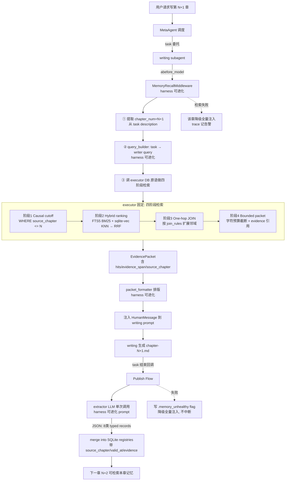
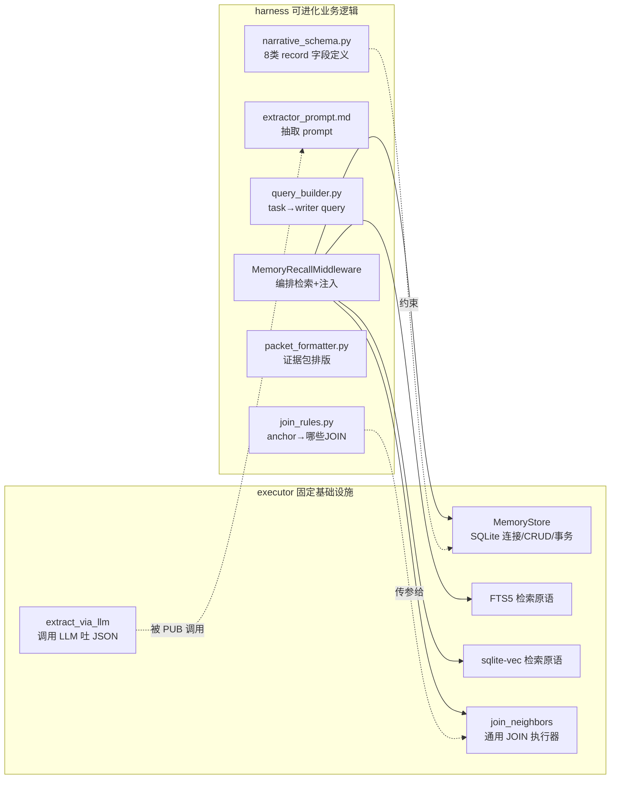

# 需求：按 NWM 论文重构记忆系统

## 核心诉求（已确认）

当前记忆系统实质是 Graphiti 的薄封装：存储全靠 Graphiti+FalkorDB，记忆单元只有 5 个实体类型，
查询条件粗糙（task 原文截断），阶段1 causal cutoff 未启用，证据包无 evidence-backed 引用。
用户要求**去掉 Graphiti 依赖，按论文从零自建一套叙事学类型化记忆系统**，并适配现有写作系统，
同时让记忆系统的部分要素作为 harness 可被 evolution 端进化。

**一句话**：把"Graphiti 壳"换成"NWM 骨架"——自己的存储、自己的 schema、自己的四阶段检索、自己的 evidence packet。

---

## 已确认决策（R1）

- **D-R1-1 存储后端**：彻底自研。不用 Graphiti、不用 FalkorDB、不引入任何图库/向量库黑盒服务。
  自己实现 typed records 存储 + 向量索引 + 图遍历。完全自主，schema/检索逻辑100%透明可控，最贴合论文"图库无关"精神。
- **D-R1-2 harness 可进化要素**：四项全选。
  - schema 定义（实体/边/typed record 字段）
  - 抽取 prompt（章节正文 → typed records 的 LLM prompt）
  - 查询构造（writing task → writer query）
  - 证据包排版（EvidencePacket.formatted 的组织）
- **D-R1-3 trace 检索审计**：完整检索审计。记录查询串、因果截止点(章节n)、命中的 typed records
  摘要(实体名+类型+source_chapter+valid_at)、packet token 数、是否截断。
  让 evolution 看到"召回了什么"而非仅"召回了几个"。

---

## 待澄清（R1 答完后浮现的新模糊点）

R1 全选最激进方案，立刻炸开三个更深的问题：

1. **[F1 存储后端] "彻底自研"的物理实现**：不用任何外部存储服务，那 typed records 落在哪？
   SQLite 单文件？JSON 文件？向量索引怎么建（sqlite-vec？numpy 内存？）？图遍历怎么实现（SQL 递归 CTE？应用层）？
2. **[F2/F4 时序锚点] 章节号 vs 故事内时间**：论文用 source_chapter 做 causal cutoff（"≤n 章"），
   但你现状用 reference_time（wall-clock），且 storybuilding 入图还引入了"故事内时间"（StoryCalendar）。
   这两个时间维度在自研系统里怎么统一？
3. **[F9 写作接缝] publish/retrieve 的触发点是否沿用**：
   现状 publish 在 events.py 的 sink 回调（storybuilding 完成/章节完成），retrieve 在 MemoryRecallMiddleware.abefore_model。
   自研后这套接缝还成立吗？还是需要前移/后移？

---

## 已确认决策（R3）

- **D-R3-1 typed records 全集（共 8 类）**：补齐论文全部 + Scene + WorldFact。
  1. ChapterDigest — 章节摘要（事件/状态变化/场景骨架）
  2. Scene — 场景事件（location/participants/event_order/reveal_order）
  3. CharacterState — 角色状态（goal/knowledge/status/location/relationship_deltas）★ NWM 核心
  4. RelationshipState — 关系状态（角色对/类型/极性/有效期）
  5. ObjectState — 关键物品状态（owner/location/condition，视题材启用）
  6. PlotPromise — 伏笔承诺（thread_id/structural_role/open|closed/payoff）★ 论文碾压点
  7. NarrativeFunction — 叙事功能（focalized_observer/dramatic_beat/turn/reader_knowledge）★ 论文碾压点
  8. WorldFact — 世界设定（fact/scope/valid_chapter_range/evidence）
  - schema 设计原则：按题材/作品可配置启用哪些 record 类型（ObjectState 等非通用类可关闭）。
- **D-R3-2 抽取触发点**：writing task 结束即抽取（events.py 的 `_on_task_completed` 检测
  `finished_subagent == "writing"` 时触发）。与现状 ingest_chapter 接缝一致，不改 review 机制。
  - 语义：writing subagent 整个 task 完成（含可能的一次修订）= 该章 finalized。
- **D-R3-3 因果锚点**：source_chapter（章节号整数）。每个 typed record 带 source_chapter 字段。
  - 写第 N+1 章检索时：`WHERE source_chapter <= N AND valid_at <= N AND (invalid_at IS NULL OR invalid_at > N)`。
  - **放弃 StoryCalendar / 故事内时间维度**（论文也不用，中文小说故事时间模糊难抽取）。
  - **放弃 wall-clock reference_time**（与故事无关，会漂移）。

---

## 已确认决策（R4）

- **D-R4-1 检索阶段2 hybrid ranking**：FTS5（BM25）+ sqlite-vec（向量），应用层 RRF 融合。
  - FTS5 虚拟表存 typed records 的可检索文本。
  - sqlite-vec 虚拟表存 records 的 embedding。
  - 两路 ranking → RRF 融合得 anchor nodes。
- **D-R4-2 检索阶段3 one-hop expansion**：**坚持 SQLite JOIN，不引入图库**。
  - ⚠️ 用户曾一度动摇考虑加回图库，经澄清后确认：typed records 本身就是图的节点和边，
    存关系表里用 JOIN 遍历 = 图遍历。无需 FalkorDB 等图库黑盒。
  - one-hop = 预定义 typed JOIN（anchor → 它参与的 Scene/Relationship/Object/Promise）。
  - JOIN 规则作为 harness 可进化要素（随 schema 进化）。
- **D-R4-3 抽取机制**：单次 LLM 多输出。每章一次 LLM 调用，一次性抽取该章包含的所有 typed records
  （结构化 JSON 输出）。extractor prompt 是 harness 可进化要素。与现状 ingest_chapter 同样一次调用，不增加成本。

---

## 已确认决策（R5）

- **D-R5-1 失败语义：降级全量注入，不中断写作**。
  - 抽取失败（LLM 超时/JSON 解析失败）→ 写 `.memory_unhealthy` flag，本作品记忆关闭，writing 回退 ContextAssembler 全量注入。
  - 检索失败（SQLite 异常）→ 该章回退全量注入，记录 trace 告警，不中断。
  - SQLite 本地存储几乎不会"连不上"，主要失败点是抽取 LLM 调用。
  - **推翻现状的"硬中断"语义（决策10）**。
- **D-R5-2 迁移兼容：不管旧数据**。
  - 新作品直接用 SQLite NWM 系统。旧作品（FalkorDB 里有数据的）记忆丢失，不迁移。
  - Graphiti/FalkorDB 相关代码删除（彻底下线，不保留 deprecated 双系统）。
- **D-R5-3 harness 边界：executor 存取原语 + harness 业务逻辑**。
  - **executor 固定（DB 原语层）**：SQLite 连接管理、表 CRUD、FTS5 调用、sqlite-vec 调用、事务、`join_neighbors(anchor_ids, join_spec)` 通用 JOIN 执行器。
  - **harness 可进化（业务逻辑层）**：schema 定义、extractor prompt、query_builder（task→writer query）、join_rules（anchor→哪些 JOIN）、packet_formatter（证据包排版）。
  - 分层与现状 MemoryBackend(固定)+MemoryRecallMiddleware(可进化) 一致，evolution 可进化查询逻辑但不会破坏 DB 结构。

---

## 关注面（动态维护）

- [x] [F1] 存储后端选型 → 彻底自研，SQLite 单文件 + sqlite-vec（D-R1-1, D-R2-1）
- [x] [F2] typed records schema 设计 → 8 类 record（D-R3-1），按题材可配置启用
- [x] [F3] 抽取（extract）机制 → 单次 LLM 多输出（D-R4-3）
- [x] [F4] registry / current-state slice → SQL 视图，valid_at/invalid_at + source_chapter 过滤取最新有效（D-R3-3）
- [x] [F5] 四阶段检索实现 → ①source_chapter cutoff ②FTS5+sqlite-vec RRF ③SQL JOIN ④bounded packet（D-R3-3, D-R4-1, D-R4-2）
- [x] [F6] evidence packet 组装 → harness 可进化排版 + evidence-backed 引用字段（D-R1-2, D-R1-3）
- [x] [F7] harness 可进化要素边界 → schema/抽取prompt/查询构造/join_rules/证据包排版（D-R1-2, D-R5-3）
- [x] [F8] trace 检索记录 → 完整检索审计（D-R1-3）
- [x] [F9] 与写作流程的接缝 → publish 在 writing task 结束回调（D-R3-2），retrieve 在 MemoryRecallMiddleware.abefore_model（沿用）
- [x] [F10] 失败语义 → 降级全量注入，不中断（D-R5-1）
- [x] [F11] 迁移与兼容 → 不管旧数据，Graphiti/FalkorDB 彻底下线（D-R5-2）

---

## 待用户最终确认（冻结前最后一关）

所有 11 个关注面已覆盖。但在标 confirmed 前，我想把整个重构后的系统全景画出来给你过目，
确保各决策之间的接缝没有矛盾。见下方【重构后系统全景】。

---

## 已确认决策（R6 — 接缝风险收尾）

- **D-R6-1 storybuilding 蓝图层不入图**：不保留独立的 seed 入图路径。记忆纯靠章节正文抽取累积。
  - 第 1 章写作时记忆为空 → 回退 ContextAssembler 全量注入（合理：第 1 章本无前文）。
  - 第 2 章起有第 1 章抽取的记忆可检索。
  - **删除现状的 ingest_storybuilding 路径**（backend._ingest_structured / _ingest_episodes）。
  - **删除 tools/storyline_parser.py 和 tools/story_calendar.py**（story_calendar 在 D-R3-3 已弃用）。
- **D-R6-2 extractor 模型由 executor 定**：LLM 调用（模型选择/JSON schema 校验/重试）在 executor 平台层，
  harness 只能改 extractor prompt。分层清晰，evolution 不会改出破坏性模型调用。
- **D-R6-3 记忆检索只在 writing subagent 触发**：MemoryRecallMiddleware 只挂 writing。
  - detail_outline / storybuilding 阶段用 ContextAssembler 全量注入（它们需要的是蓝图文件，不是已写章节记忆）。
  - causal cutoff 语义只在 writing 场景定义：cutoff = 当前要写的章节号 - 1。

---

## 重构后系统全景

### 数据流（一次写作请求中记忆系统的生命周期）



### 代码分层（executor 固定 vs harness 可进化）



### SQLite Schema 骨架（8 类 typed record）

```sql
-- 每类 record 一张表，共享时序字段
CREATE TABLE character_state (
    id INTEGER PRIMARY KEY,
    workspace_id TEXT NOT NULL,        -- 作品隔离（或一作品一db文件）
    source_chapter INTEGER NOT NULL,   -- 抽取自第几章（因果锚点）
    valid_at INTEGER NOT NULL,         -- 从第几章开始有效
    invalid_at INTEGER,                -- 第几章被取代（NULL=仍有效）
    name TEXT NOT NULL,                -- 角色名
    goal TEXT, knowledge TEXT,         -- NWM 核心字段：目标/认知
    status TEXT, location TEXT,
    relationship_deltas TEXT,          -- JSON
    evidence_span TEXT NOT NULL        -- evidence-backed 引用（原文片段）
);
-- relationship_state / scene / object_state / plot_promise /
-- narrative_function / world_fact / chapter_digest 同构

-- 向量索引（sqlite-vec 虚拟表）
CREATE VIRTUAL TABLE character_state_vec USING vec0(
    embedding float[768],
    record_id INTEGER
);

-- 全文检索（FTS5）
CREATE VIRTUAL TABLE records_fts USING fts5(
    record_type, name, content, source_chapter UNINDEXED
);

-- registry 视图：取"最新有效切片"（论文 §3.3 核心）
CREATE VIEW current_character_state AS
SELECT * FROM character_state c
WHERE c.invalid_at IS NULL
   OR c.invalid_at > (SELECT MAX(source_chapter) FROM character_state
                      WHERE workspace_id = c.workspace_id);
```

### Trace 检索审计（run_meta 事件，D-R1-3）

```json
{
  "type": "run_meta",
  "source": "middleware",
  "agent_name": "writing",
  "input": {
    "memory_quality": {
      "chapter_query_for": 11,
      "causal_cutoff": 10,
      "query": "第11章写作查询：林晚发现玉佩秘密后与赵默对峙...",
      "writer_query_constructed": "角色:林晚 赵默; 事件:玉佩; 状态:对峙",
      "stage1_after_cutoff": 47,
      "stage2_anchor_nodes": ["Character:林晚", "Object:玉佩", "Promise:复仇之约"],
      "stage3_expanded_records": 23,
      "hits": [
        {"type": "CharacterState", "name": "林晚", "source_chapter": 7, "valid": "ch7-至今"},
        {"type": "PlotPromise", "name": "复仇之约", "status": "open", "source_chapter": 3},
        {"type": "ObjectState", "name": "玉佩", "owner": "林晚", "source_chapter": 5}
      ],
      "packet_tokens": 3400,
      "truncated": false,
      "retrieval_ok": true
    }
  }
}
```

### 接缝清单（与现状的改动点）

| 接缝 | 现状 | 重构后 | 改动程度 |
|------|------|--------|----------|
| 存储 | Graphiti + FalkorDB | SQLite + sqlite-vec + FTS5 | **重写** MemoryBackend → MemoryStore |
| schema | narrative_schema.py (5类, Graphiti格式) | narrative_schema.py (8类, SQLite DDL + Pydantic) | **重写** |
| 入图管道 | ingestion.py (调 Graphiti add_episode) | ingestion.py (调 extractor LLM → merge SQLite) | **重写** |
| 检索 | backend.retrieve (Graphiti search_) | 四阶段: cutoff + FTS5/vec RRF + JOIN + packet | **重写** |
| 中间件 | MemoryRecallMiddleware.abefore_model | 同名，但内部调新四阶段 | 接口不变，实现重写 |
| trace 埋点 | TraceMemoryQuality (数量) | TraceMemoryQuality 扩展 (含 hits/evidence) | **扩展字段** |
| 失败语义 | 硬中断 RuntimeError | 降级全量注入 | **改变语义** |
| tools/ | storyline_parser.py + story_calendar.py | 删除 story_calendar；storyline_parser 改为 seed extractor（storybuilding 蓝图层入图） | **删改** |
| events.py | _on_writing_chapter_done 调 ingest_chapter_sync | 同名，调新的 extract_and_publish | 接口不变 |
| ContextAssembler | 全量注入（memory 关闭时回退） | 保留，作为降级路径 | 不变 |
| Graphiti/FalkorDB 代码 | client.py/backend.py/graphiti相关 | **删除** | 下线 |
