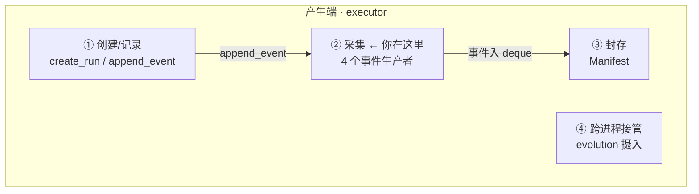
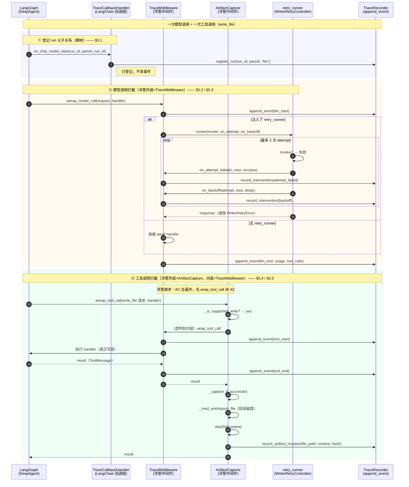
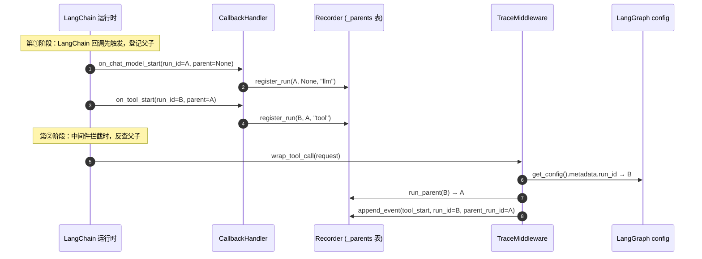
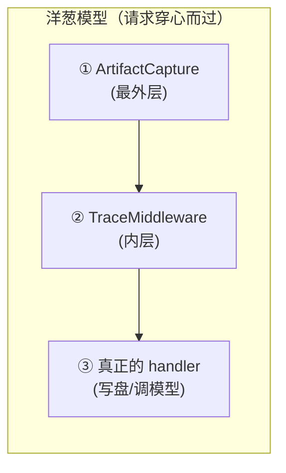

# 02 · 采集（四个事件生产者）

> **层位声明（最高优先级）：纯机制层。** 本文档只讲机制运转、设计动机、数据流与边界。
> 不贴 `file:line`，不贴真实代码片段。伪代码用语言无关骨架。
> **诚实铁律**：代码确证→正常陈述；合理推断→标【推测】；看不清→如实说；业界范式未联网核实→标注。
> **阅读约定**：本文按"一次完整运行"为主线从头讲到尾。每节开头标注【主线位置】，告诉你此刻走到哪一步。

---

## 0. 你在全图的位置



本文档负责产生端的第二步：**DeepAgent 运行时正在发生 LLM/Tool 调用，谁把它们翻译成结构化事件？**

> **术语接地——DeepAgent**：本项目用的 agent 框架（基于 LangGraph）。你只要知道它"驱动模型思考→调用工具→再思考"的循环即可，不必了解内部。
> **术语接地——append_event**：把一条事件追加进 trace 时间线的唯一入口（01 讲）。本文的所有生产者最终都汇入它。

---

## 1. 先建立现场：一次 agent 运行到底发生了什么

> 【主线位置：因果链起点。在讲"谁采集"之前，先看清"采集的对象是什么"。】

要理解采集层，先别管"采集"这个词，先盯住一件事：**当用户点下"开始写作"，executor 里到底在发生什么？**

一次写作任务跑起来，DeepAgent 进入"模型思考 → 调用工具 → 再思考"的循环。在这个循环里，**有四件事同时在发生**，但它们散落在不同的代码层，默认谁也不记录谁：

| 现场 | 在发生什么 | 不记录会怎样 |
|---|---|---|
| **模型在想** | 每轮 LLM 调用：输入一堆消息，产出一段回复（可能含"我要调某某工具"） | 你只看到"任务开始→任务结束"，中间 30 秒的黑洞无从复盘 |
| **工具在动** | 模型决定调 `write_file`/`read_file` 等工具，工具执行后有返回 | 知道"调了工具"，但不知道调用了几次、结果是什么 |
| **文件在变** | `write_file`/`edit_file` 真的把内容写进 workspace 磁盘 | 知道"工具调用了"，但**不知道文件实际变成了什么** |
| **SDK 在偷偷重试** | OpenAI/langchain SDK 传输失败时默认自己退避重试（`max_retries=2`） | 用户看到的是"等了 18 分钟没反应"，分不清是模型慢还是 SDK 在重试 |

**这就是采集层要解决的问题：把这四件散落的"现场动作"，翻译成时间线上一条条结构化、可回放、可作为证据的事件。**

---

## 2. 从现场到需求：四个痛点，催生四个生产者

> 【主线位置：因果链中段。从"现场有什么"过渡到"为什么需要分工"。】

上一节的"不记录会怎样"列了四个黑洞。展开看，每个黑洞都是一个具体的、曾经真实踩过的坑：

### 痛点 A：LLM 调用是个黑盒
没有人在模型调用的前后插桩，你只能看到"任务开始了 → 任务结束了"。线上出问题（生成卡住、token 爆量、工具反复失败）时无从复盘，只能让用户重试。
> 真实踩坑：commit `6911c25` 记录了"trace LLM 节点无输出"的故障——即便有插桩，只要 `output` 字段契约（`{messages:[...]}`）没对齐，前端抽屉就显示空。可见"看得见 LLM"这一层是唯一通道，且很脆。

### 痛点 B：交付物变了，但你不知道变成了什么
Agent 用 `write_file` 写了 `/novel.md`，然后又 `edit_file` 改了同一文件。trace 里只有两条干巴巴的"工具调用了"事件——**没有内容快照**。事后要回答"第 3 步时小说写到哪了？""哪一步把主角名字写错了？"——无解。
更狠的问题：即使你想存内容，**工具调用参数里传的内容 ≠ 真正落盘的内容**（详见 §5.5）。

### 痛点 C：SDK 内部重试是"隐形时间税"
OpenAI/langchain SDK 默认 `max_retries=2`，传输失败会自己退避重试。这段时间在 trace 里**完全不可见**——用户看到的就是"等了 18 分钟没反应"。commit `6911c25` 之前的线上故障正是这个根因：SDK 默认重试 × 外层 task 重放相乘，等待时间失控。
没有专门的事件，你**无法区分**"模型真的在思考很久"和"SDK 在悄悄重试第 2 次"。

### 痛点 D：调用树是散落的孤岛
LangChain 内部每次调用都有一个 `run_id` 和它的 `parent_run_id`（"这次 tool 调用是哪次 llm 调用发起的"）。但负责插桩的中间件层拿不到这个信息——它只知道自己被调用了。如果没有人预先登记这些父子关系，前端就重建不出"工具调用嵌套在哪次模型调用下"的调用树，时间线变成一锅平铺的事件。

> 【术语接地——run_id / parent_run_id】：LangChain 给每次调用发一个唯一 ID（run_id），并记下"我是被哪次调用发起的"（parent_run_id）。把 run_id 按 parent_run_id 串起来，就是一棵调用树。本文后面会反复用到这两个 ID。

---

**四个痛点，对应需要四个专职角色去治。** 这就是为什么采集层是"四个生产者"而不是一个。

## 3. 四个跟线记者：分工总览

> 【主线位置：因果链终点。读者已经知道现场有什么、为什么需要分工，现在才介绍四个角色。】

**生活化类比 ——「新闻编辑部的四个跟线记者」**

想象一家新闻社报道一场现场活动（一次写作任务）。编辑部主任（`TraceRecorder`）只负责把稿子排版上墙（`append_event` 落盘），自己不去现场。现场派了四个记者，分工明确：

| 记者（生产者） | 跟哪条线 | 治哪个痛点 | 发回什么稿子（事件类型） |
|---|---|---|---|
| **TraceMiddleware** | LLM 思考 & Tool 执行 | A | `llm_start/end/error`、`tool_start/end/error` |
| **ArtifactCaptureMiddleware** | 文件被改了 | B | `artifact_revision`（带内容 hash 的版本快照） |
| **RetryController + retry_runner** | SDK 在偷偷重试 | C | `middleware_intervention`（attempt 失败/退避） |
| **TraceCallbackHandler** | LangChain 的 run 调用树骨架 | D | 注册 `run_id → parent_run_id`（不直接发事件，只登记父子关系） |

四个记者互相不抢功：各自盯着自己的线，写完稿子统一扔进主任桌上的稿箱（`append_event`）。读者看时间线时，四条线的稿子按时间顺序交织在一起，形成完整的执行回放。

> **一句话先记住**：前三个记者都**发事件**（稿子），第四个（CallbackHandler）**不发事件，只登记父子关系**——它给前三位的稿子盖上"谁是谁的爹"的章。这是它最特别的地方，后面会专门讲为什么。

接下来，我们跟着一次完整的运行，看这四个记者怎么**按时间顺序**依次出场、穿插协作。

---

## 4. ★ 主线图：一次完整运行怎么串起四个记者

> 【主线位置：全局主线。这是理解全文的钥匙——先建立"一次运行的全景"，再下钻每个记者。】

下面这张时序图，画出**一次模型调用 + 一次 write_file 工具调用**里，四个记者怎么穿插。后面 §5 的每一小节，都会标注【主线位置】，告诉你此刻走到这张图的哪一步。



**看不懂这张图没关系**，§5 会沿主线逐步拆解。现在你只需要抓住一个结构：**蓝色的①是建树（CallbackHandler），橙色的②是模型调用拦截（TraceMiddleware + 可选 retry），绿色的③是工具调用拦截（ArtifactCapture + TraceMiddleware）**。三段按时间顺序发生，每段都有不同的记者出场。

---

## 5. 沿主线走一遍

> 【主线位置：详细展开。四个记者按一次运行的时间顺序串讲，每节标注在主线图的哪一步。】

### 5.1 起点：CallbackHandler 先登记 run 父子关系（建树骨架）

> 【主线位置：主线图蓝色①阶段。这是运行最早发生的事——在中间件拦截之前，回调层先登记父子关系。】

**为什么这一步最先？** 因为后面 TraceMiddleware 发事件时需要知道"这次调用是谁发起的"（parent_run_id），而这个信息只有 LangChain 的回调层拿得到。所以必须**先登记，后查询**。

> 【术语接地——洋葱中间件】：Express/Koa 那种"同心圆"模型——请求像穿心而过，从外向内穿过每一层，每层可以在"进入前"和"退出后"各做点事（比如发 `tool_start` 和 `tool_end`）。本项目里，TraceMiddleware 和 ArtifactCapture 都是洋葱中间件，它们的**相对顺序**很关键（§6 专讲）。
>
> 【术语接地——LangChain 回调层】：LangChain 在每次调用（模型/链/工具）的起止点会触发回调（`on_chat_model_start` 等）。`TraceCallbackHandler` 就是挂在这些回调上的监听器。

**TraceCallbackHandler 的职责**：在 LangChain 回调层（`on_chat_model_start`/`on_chain_start`/`on_tool_start`）**登记** run 的父子关系，往 recorder 的几张内存表里写条目。**它是四个生产者里唯一不直接发事件的**——只调 `register_run`。

**机制骨架**：

```
class TraceCallbackHandler(BaseCallbackHandler):
    run_inline = True                       # 同步执行，不开线程

    function on_chat_model_start(serialized, messages, run_id, parent_run_id, ...):
        recorder.register_run(run_id, parent_run_id, "llm", serialized.name, metadata)

    function on_chain_start(...):
        recorder.register_run(run_id, parent_run_id, "chain", ...)

    function on_tool_start(...):
        recorder.register_run(run_id, parent_run_id, "tool", ...)
```

**它和 TraceMiddleware 怎么配合建调用树？** 这是一个**两阶段握手**：



**为什么需要两阶段，不能 CallbackHandler 直接发事件？**
1. CallbackHandler 拿不到中间件层的完整上下文（model_name、duration、usage、tool_args 这些在中间件层才齐全）。
2. CallbackHandler 的契约是"轻量登记"，`run_inline=True` 要求它**不能阻塞**——如果它在回调里发完整事件，会拖慢 LangChain 主流程。
3. 分离职责：CallbackHandler 只管"树形结构"（谁是谁的爹），TraceMiddleware 只管"语义内容"（调用了什么、结果如何）。两者通过 `run_id` 这个公共键关联。

> 【代码确证】`register_run` 往 `_parents/_run_kinds/_run_names/_run_metadata` 写；`run_parent(run_id)` 反查；`_current_run_ids` 在中间件层调 `run_parent`——这条链确证。
> 【推测】`run_inline=True` 是 LangChain BaseCallbackHandler 的一个属性，表示回调在调用线程内同步执行而非提交到回调线程池。本项目用它保证"register 先于 wrap 发生"的时序——但这一时序保证的细节【推测】依赖 LangChain 内部实现，未联网核实。

---

### 5.2 第一站：TraceMiddleware 拦截 LLM 调用（填血肉）

> 【主线位置：主线图橙色②阶段的开头。模型要调用了，TraceMiddleware 在前后插桩。】

**职责**：在每次 LLM 调用和 Tool 调用的**前后**插桩，产出 `llm_start/end/error` 和 `tool_start/end/error` 六类事件。

**机制骨架**（语言无关）：

```
function wrap_model_call(request, handler):
    started = perf_counter()
    emit llm_start { model_name, input.messages, run_id, parent_run_id }
    try:
        response = handler(request)
        emit llm_end { output, usage, tool_calls, duration_ms }
        return response
    except exc:
        if exc is GraphInterrupt:          # HITL，不是错误
            record_hitl(phase=model, state=requested)
        else:
            emit llm_error { error, duration_ms }
        rethrow                           # 拦截器绝不吞异常
```

> 【术语接地——HITL / GraphInterrupt】：HITL = Human-In-The-Loop（人机协作）。当 agent 用 `ask_user` 工具向用户提问时，LangGraph 抛 `GraphInterrupt` 暂停执行等用户回答。**这是正常控制流，不是错误**——如果记成 error，监测面板会误报"失败了"。

**关键设计点（每点做什么 / 怎么做 / 为什么）**：

| 环节 | 做什么 | 怎么做 | 为什么 |
|---|---|---|---|
| `started = perf_counter()` | 起点 | 包裹前打点 | `duration_ms` 必须覆盖**整个**调用（含 retry），不能从 handler 内部打 |
| `_record_model_start` 先发 | 开始事件 | 直接 `append_event` | 即便后续崩溃，也留下"开始过"的证据，时间线不缺头 |
| `GraphInterrupt` 特判 | 不记 error | 走 `record_hitl` | `ask_user` 是正常控制流，记成 error 会让监测面板误报，commit `6911c25` 系列排障时反复强调这点 |
| `rethrow` 所有异常 | 拦截器透明 | 不吞 | 拦截器是观测设施，**改变控制流是 ArtifactCapture 的事，不是它的事** |
| `_current_run_ids()` | 取父子 | 从 LangGraph `get_config()` 的 metadata 拿 `run_id`，再查 recorder 的 `_parents` 表反查 parent | 把 CallbackHandler 预登记的父子关系（§5.1）接到事件上 |

**数据流**：`Graph → wrap_*_call(request, handler) → 在前后插 append_event → handler 原样执行`。拦截器本身**不持有状态**（除了 trace_id/agent_name 这类装配期常量），所有状态都在 recorder。

> 【代码确证】六类事件（llm_start/end/error + tool_start/end/error）的字段、`source="middleware"` 标记、`run_id/parent_run_id` 由 `_current_run_ids` 注入，均在 `trace_middleware.py` 中确证。

#### 附带职责：record_skill_activation_from_tool

`tool_end` 时如果工具名是 `read_file`/`read`，会顺手调 `record_skill_activation_from_tool`：检查这次读的文件路径是不是注册过的 skill runtime path，如果是，补一条 `skill_activation` 事件。这是把"工具调用"和"技能被激活"两个语义层关联起来的钩子——单点插桩，避免在多处重复判断。

---

### 5.3 分支：LLM 调用失败时，重试怎么可见化

> 【主线位置：主线图橙色②阶段里，当 `retry_runner` 被注入时的分支。这是主线上的"失败分支"，不是独立宇宙。】

正常情况下，§5.2 的 `handler(request)` 调用成功就发 `llm_end` 结束。但如果模型调用失败（网络抖动、超时），且装配时**注入了 retry_runner**，TraceMiddleware 会把控制权交给重试机制——这就是痛点 C 的治理现场。

> 【术语接地——attempt / budget / backoff】：
> - **attempt**：一次传输尝试。`max_attempts=2` 意味着最多试 2 次。
> - **budget（重试预算）**：允许重试的次数上限，由 `WriterRetryController` 持有，是"预算单一权威"。
> - **backoff（退避）**：两次尝试之间的等待（如等 1 秒再试），避免猛打失败的服务器。

这是四个生产者里**协作链最长**的一个，因为它横跨了"平台层（TraceMiddleware）"和"领域层（WriterRetryController）"两个分层。

> 【术语接地——platform / domains 分层】：本项目把代码分成两层——`platform`（平台层，通用基础设施，如 trace 中间件）和 `domains`（领域层，具体业务，如 writing 写作领域）。**铁律：platform 层不得 import domains 层**——平台不能依赖具体业务。这条铁律直接决定了重试机制的协作方向（见下文）。

**为什么需要两个角色？**
- `WriterRetryController`（领域层 `domains/writing/retry.py`）：**真正的重试预算持有者**。最多 2 次传输尝试，带错误分类（可重试/不可重试/部分响应）、退避、结构化 outcome。它**不碰 recorder**——单一职责。
- `retry_runner`（领域层工厂 `_make_retry_runner_factory` 产出，注入到平台层 TraceMiddleware）：**桥**。它把 controller 的 `AttemptOutcome` 翻译成平台层 TraceMiddleware 的 `record_attempt_failed/record_backoff` 回调。
- `TraceMiddleware.record_attempt_failed/record_backoff`（平台层）：**真正写事件的人**。把回调转成 `record_intervention`（`middleware_intervention` 事件）。

**为什么不让 controller 直接写事件？**
> 分层铁律：`platform` 层不 import `domains` 层。重试是写作领域的策略（其他领域可能不重试），但事件格式是平台层的契约。所以方向反过来——**领域层把策略注入平台层，平台层用平台层自己的方法写事件**。这就是依赖倒置（DIP）：高层（平台）不依赖低层（领域），低层把实现注入高层。

**机制骨架**（三层协作）：

```
# 平台层 TraceMiddleware（被注入了 retry_runner）
async function awrap_model_call(request, handler):
    if retry_runner is not None:
        return await _awrap_model_call_with_retry(request, handler)
    ...

async function _awrap_model_call_with_retry(request, handler):
    emit llm_start                          # 只发一次
    try:
        response = await retry_runner(      # 把控制权交给领域层
            invoke = lambda: handler(request),
            on_attempt = self.record_attempt_failed,
            on_backoff   = self.record_backoff,
        )
        emit llm_end                        # 只发一次
    except exc:
        emit llm_error                      # duration 覆盖全部 attempt
        rethrow

# 领域层 retry_runner（工厂产物）
async function runner(invoke, on_attempt, on_backoff):
    budget = RetryBudget(
        max_attempts = 2,
        on_attempt_complete = lambda outcome:
            None if outcome.success
            else on_attempt(outcome.attempt_number, 2, outcome.error_class),
        on_backoff = lambda _aid, attempt, delay:
            on_backoff(attempt, attempt+1, delay),
    )
    tracked = track_partial_response(invoke)   # 检测部分响应
    return await WriterRetryController(budget).acall(tracked.invoke, tracked.is_partial)

# 领域层 WriterRetryController._run_async
async function _run_async(invoke, is_partial):
    attempt_id = uuid()
    for attempt in 1..max_attempts:
        started = perf_counter()
        try:
            response = await invoke()
            notify(AttemptOutcome(success=True))
            return response
        except exc:
            category, retryable = classify_error(exc)
            if category in {cancel, interrupt}: rethrow   # 控制流不吞
            outcome = record_failure(...)
            notify(outcome)                                # → 触发 on_attempt 回调
            if not retryable or had_partial_response:
                raise WriterRetryError(outcome)            # 不重放
            if attempt == max_attempts: break
            do_backoff(...)                                # → 触发 on_backoff 回调
            continue
    raise WriterRetryError(last_outcome)                   # 预算用尽
```

**关键设计点**：

| 环节 | 做什么 | 为什么 |
|---|---|---|
| `llm_start` 只发一次 | 不在每次 attempt 重发 | 一次**逻辑**调用对应一条 llm_start，attempt 是它内部的子步骤 |
| attempt 失败 → `record_intervention` | 不是 `llm_error` | attempt 失败不是逻辑调用失败，是"中间过程"。用 `middleware_intervention` 这种"控制流可见性"事件表达 |
| backoff → `record_intervention` | 同上 | "正在等 1 秒重试"是可观测信号，让用户知道"没卡死，在重试" |
| 最终失败 → `llm_error`（duration 覆盖全部 attempt） | 在最外层 try/except | duration_ms 从第一次 attempt 的 started 算到最终抛错，反映真实等待 |
| `on_attempt_complete` 回调失败被吞 | `except Exception: pass` | 观测失败不得影响重试主流程——观测是"锦上添花"，不能让它把一次本会成功的重试判失败 |
| 部分响应禁止重放 | `had_partial_response → retryable=False` | 已收到流式 chunk 后断流，重放会重复计费/重复副作用 |

> **根治的痛点**：commit `6911c25` 系列修复的"18 分钟等待"根因之一，就是 SDK 默认 `max_retries=2` 与外层 task 重放相乘。本项目用 `build_writer_model(max_retries=0)` **显式关闭 SDK 内部重试**，把预算集中到 `WriterRetryController`，再通过 `middleware_intervention` 让重试**可见**。这是一套"集中预算 + 可见化"的组合拳。

---

### 5.4 第二站：TraceMiddleware 拦截 tool 调用

> 【主线位置：主线图绿色③阶段的中段。模型决定调 write_file 了，工具调用也要经过 TraceMiddleware 插桩。】

机制上，tool 调用的拦截和 §5.2 的 LLM 拦截**完全同构**——都是洋葱中间件在前后插 `tool_start`/`tool_end`/`tool_error`。区别只在于拦截的工具调用而非模型调用，伪代码骨架一致（把 `wrap_model_call` 换成 `wrap_tool_call`）。

但工具调用有一个 LLM 调用没有的关键点：**它会被 ArtifactCapture 包在最外层**。这就是主线图绿色③阶段"AC 在最外，TM 在内"的原因——下一节专门讲这个最外层在做什么。

---

### 5.5 终点：ArtifactCapture 写后回读取证

> 【主线位置：主线图绿色③阶段的最后。tool_end 之后，ArtifactCapture 在最外层退出时做"写后回读"。这是痛点 B 的治理现场。】

**职责**：在 `write_file`/`edit_file` 成功后，**回读 workspace 磁盘文件**，算 sha256，冻结一条不可变的 `ArtifactRevision`。

**机制骨架**：

```
function wrap_tool_call(request, handler):
    if not _is_supported_write(request):      # 只拦截 write_file/edit_file 且路径在白名单
        return handler(request)
    result = handler(request)                  # 先执行，真正写盘
    _capture_if_successful(request, result)   # 成功才取证
    return result

function _capture_if_successful(request, result):
    if result is ToolMessage and result.status == "error":
        return                                 # 工具自己报错了，不取证
    try:
        content = _read_workspace_file(path)   # 回读磁盘！
        hash = sha256(content)
        recorder.record_artifact_revision(trace_id, agent, file_path, content, hash, ...)
    except exc:
        mark_capture_degraded(...)             # 取证失败要标记
        if self.strict: raise EvidenceCaptureError   # 严格模式连写都算失败
```

**核心问题：为什么必须"写盘后回读"，而不是"用工具调用的传入参数"？**

这是整个采集层**最重要的设计决策**，值得单独讲透。用一个具体场景说清楚：

> 场景：模型这一轮同时发了 3 个 `edit_file`，都改 `/novel.md`。

| 方案 | 用传入参数 | 写后回读（本项目） |
|---|---|---|
| 参数内容 | 模型**想写**的内容（可能是 diff 片段、可能基于过期的旧版本） | 磁盘上**实际**的最终内容 |
| 并发竞争 | 看不到——三个 edit 的参数互不知道彼此 | 看得到——回读时并发已经收敛 |
| 覆盖写 | 漏掉覆盖语义（参数体现不出来） | 抓得到最终字节 |
| 内容真实性 | 低（参数 ≠ 落盘，可能被 backend 拒、被 guard 改） | 高（hash 是对真实字节的承诺） |
| 副作用对账 | 无 | 有——`record_artifact_revision` 内部会再算一次 hash 与传入 hash 比对，不一致标 `artifact_readback_hash_mismatch` |

> 【论据铺垫——为什么上面表格里"并发竞争"和"覆盖写"是真实风险】：
> - **并发竞争**：三个 `edit_file` 同时改同一文件，如果不加锁会互相覆盖。本项目用 `FileWriteSerializeMiddleware` 这个中间件**按文件路径加锁串行化**写操作，保证同一文件的写一个接一个。回读发生在锁释放后，所以读到的是收敛后的最终态。
> - **覆盖写**：本项目的 `OverwritingFilesystemBackend` 允许某些路径**整体覆盖**（而非追加），这意味着后一次写会完全替换前一次的内容。传入参数体现不出"我是覆盖了别人"，只有回读磁盘才知道最终留下了什么。

**回读之后还有第二道保险**：`record_artifact_revision` 拿到 content 后会**再算一次 hash**，与中间件传来的 hash 比对；还会 `store.put` 后**再 `store.get` 校验**内容地址存储回读一致。任何一环不一致 → `mark_capture_degraded` + 抛错。这是"取证"而非"记录"的关键区别——**取证要求事后能在法庭（审计/复现）上经得起质疑**。

> 【术语接地——PayloadRef / 内容地址存储】：事件正文（如 LLM 的完整输入输出、文件内容快照）体积可能很大，不全塞进事件里。`PayloadRef` 是一个"正文外置引用"——事件里只存一个指针，指向单独存储的正文 blob。这些 blob 用内容的 sha256 作地址（内容地址存储，content-addressable storage），所以 `store.put` 后再 `store.get` 能校验"存进去的"和"读出来的"字节一致。正文怎么治理（剥离推理/拒凭据等）是 07 的事，采集层只负责把 PayloadRef 挂到事件上。

> 【代码确证】`_read_workspace_file` 用 `resolve()` + `relative_to(root)` 防路径穿越；`record_artifact_revision` 内部 hash 二次校验 + payload store 回读校验 + 同一 (tool_call_id, logical_key) 的 hash 冲突检测，均在 recorder.py 中确证。

**strict 模式的代价**：`strict=True` 时取证失败会抛 `EvidenceCaptureError`——**写入已经成功，但取证失败会让整个调用判失败**。这是一种"宁可信不可"的取舍：在需要严格证据链的场景（A/B 测试、evolution 评估），宁可不要这次结果，也不要"结果存在但不可复盘"。生产路径是否开 strict【推测】取决于调用方装配时的配置，probe_harness 用 `strict=True`。

**捕获范围**：只有写"版本化产物路径"才取证（`/demand.md`、`/novel.md`、`/character/`、`/chapter/` 等）。临时文件、日志文件不取证——避免事件爆炸。

**回到主线**：到这里，一次完整运行（一次 LLM 调用 + 一次 write_file）走完了。四个记者按"CallbackHandler 建树 → TraceMiddleware 拦 LLM →（失败则 retry 可见化）→ TraceMiddleware 拦 tool → ArtifactCapture 写后回读"的顺序依次出场，所有事件都汇入 `append_event`。后面的章节是横向补充（装配顺序、决策对比、理论、边界），不再沿主线走。

---

## 6. 洋葱中间件的装配顺序（关键！）

> 【主线位置：横向补充。回到主线图绿色③阶段"AC 在最外，TM 在内"的疑问——为什么是这个顺序？】

§5 里 TraceMiddleware 和 ArtifactCapture 都是洋葱中间件。它们的**相对顺序**决定了"谁先拦截、谁后拦截"，这直接影响事件顺序和取证正确性。

### 6.1 装配机制：`artifact_capture_scope` + `create_deep_agent` 包装

平台层用 `ContextVar`（`_ARTIFACT_CAPTURE_BINDING`）在装配期携带取证绑定，然后 monkey-patch `create_deep_agent`，在每次编译 DeepAgent 时**自动注入** `PlatformArtifactCaptureMiddleware` 到中间件列表**最前面**：

```
function _with_capture(middleware_list, binding, agent_name):
    if any item is PlatformArtifactCaptureMiddleware: return middleware_list   # 幂等
    capture = PlatformArtifactCaptureMiddleware(recorder, trace_id, workspace, agent, strict)
    result = [capture, *middleware_list]        # ← 放最前面！
    recorder.record_middleware_assembly(trace_id, agent_name, result)   # 记录装配快照
    return result
```

### 6.2 洋葱顺序与事件顺序



请求向下穿心（外→内），响应向上穿心（内→外）。对于一次 `write_file`：

| 时序 | 层 | 动作 | 事件 |
|---|---|---|---|
| 1 | ArtifactCapture 进 | `_is_supported_write` 判断 | — |
| 2 | TraceMiddleware 进 | `tool_start` | `tool_start` |
| 3 | handler | 真正写盘 | — |
| 4 | TraceMiddleware 出 | `tool_end` | `tool_end` |
| 5 | ArtifactCapture 出 | 回读 + `record_artifact_revision` | `artifact_revision` |

**为什么 ArtifactCapture 必须在最外层？**
- 它要在**所有其他中间件都处理完、写盘彻底完成后**才回读。如果它在内层，回读时可能别的中间件还在改文件，hash 就不准了。
- 它要包裹住 TraceMiddleware 的 `tool_end`，确保 `artifact_revision` 事件排在 `tool_end` **之后**——时间线上"工具完成 → 产物冻结"的因果关系清晰。

> 【代码确证】`_with_capture` 用 `[capture, *middleware]` 把 capture 放最前，且 `record_middleware_assembly` 把最终栈快照写进 trace（供事后审计"当时装配了哪些中间件、什么顺序、什么版本"）。

---

## 7. 决策对比

> 【主线位置：横向补充。采集层的设计不是唯一解，对标业界。】

### 7.1 采集策略对比

| 维度 | **本项目（洋葱中间件 + 回调登记）** | OpenTelemetry SDK 自动埋点 | LangChain Callbacks 单层 | Claude Code trace | Devin 执行记录 |
|---|---|---|---|---|---|
| 采集点 | 中间件洋葱 + LangChain 回调双通道 | 字节码/装饰器自动织入 | 仅 LangChain 回调 | 工具调用边界记录 | session 级日志 |
| LLM 输入输出 | 完整（PayloadRef 引用，不内联） | 通常 span attribute，体积可控差 | 有但格式碎 | 【未核实】摘要为主 | 文本日志 |
| 工具调用 | tool_start/end + 内容快照 | span | 回调 | 工具名+结果 | 操作录屏/步骤 |
| 产物版本 | **回读磁盘 + hash 冻结**（独有） | 无原生概念 | 无 | 无 | 文件 diff |
| 重试可见 | middleware_intervention 事件 | span event（retry） | 无 | 无 | 无 |
| 调用树 | run_id 父子 + anchor_id | span 父子 | run 父子 | 【未核实】 | 步骤链 |
| 侵入性 | 中（要写中间件 + 装配注入） | 低（自动） | 低 | 低 | 低 |
| 分层隔离 | 平台/领域严格分离（注入式） | 单一 SDK | 单一回调 | — | — |

**本项目选择的动机**：
- **不选 OTel 自动埋点**：写作场景需要"产物版本快照"这种领域语义，OTel 通用 span 表达不了；且自动埋点拿不到 LangChain 内部 run 父子关系。
- **不选纯 LangChain Callbacks**：回调层拿不全中间件层的语义（duration/usage/tool_args），且 `run_inline` 时序保证脆弱；中间件层是 LangGraph 的"第一公民"，更稳。
- **双通道并用**：Callbacks 建"树骨架"（轻量、不能阻塞），中间件填"血肉"（重量、可阻塞）——各取所长。

### 7.2 重试可见化策略对比

| 维度 | **本项目** | SDK 默认重试 | 外层无差别重放 |
|---|---|---|---|
| 预算归属 | 单一权威（WriterRetryController） | SDK 内部（不可见） | task 层（粗粒度） |
| 可见性 | middleware_intervention 事件 | 黑盒 | 仅看到 task 失败 |
| 重试相乘风险 | 无（显式 max_retries=0） | 有（SDK×外层） | 严重 |
| 部分响应保护 | 有（禁止重放） | 无 | 无 |

---

## 8. 理论抽象

> 【主线位置：横向补充。把 §5 的机制往上抽一层。】

### 8.1 第一性原理：观测 = 不可变事件流 + 因果关联

采集层的本质是把一个**连续的、有副作用的执行过程**（agent 跑了一轮，改了几个文件）投影成一个**离散的、不可变的事件序列**。这件事要成立，需要三个第一性保证：

1. **不可变性**：事件一旦发出就不改（append-only jsonl）。ArtifactRevision 用 hash 冻结就是这个原则的极致——连"产物内容"都要变成不可变版本。
2. **因果关联**：孤立的事件没意义，必须能回答"这次 tool 调用是哪次 llm 触发的"。`run_id/parent_run_id` + `anchor_id` 就是因果链。
3. **观测不影响被观测**（量子力学借喻）：采集失败不能让写作失败。这条体现在三处——`_emit_attempt_event` 吞掉 recorder 异常、ArtifactCapture 的 strict 是可选的、`_record_mechanism` 用 ContextVar 防自指（观测设施自己产生的事件不再被观测）。

### 8.2 范式归属

- **洋葱中间件（Onion / Middleware Pipeline）**：ArtifactCapture 和 TraceMiddleware 属于这类——同心圆，请求穿心而过，每层只做自己的事。这是 Express/Koa/Symfony 等框架的经典范式。
- **观察者模式（Observer）+ 装饰器（Decorator）**：CallbackHandler 是观察者（订阅 LangChain 事件），TraceMiddleware 是装饰器（包住 handler）。
- **依赖注入 + 分层架构**：retry_runner 从领域层注入平台层，是经典的"策略注入"，避免高层依赖低层（DIP）。
- **CQRS/Event Sourcing 的轻量版**：事件流就是状态变更的 source of truth，前端投影（属 06）是从事件流重建视图——这本质是 Event Sourcing。

---

## 9. 边界与代价

> 【主线位置：横向补充。机制什么时候会失效。】

### 9.1 何时失效

| 场景 | 后果 | 兜底 |
|---|---|---|
| 跳过 DeepAgent 直接调 LLM（如 evolution 的 `llm.chat` httpx 直连） | TraceMiddleware 拦不到，事件流缺 llm span | 用 `TraceLlmObserver`（DEC-001 桥）手动注入 source="system" 的 llm 事件 |
| 中间件装配顺序被破坏（capture 不在最外） | artifact_revision 时序错乱、回读 hash 可能不准 | `record_middleware_assembly` 留快照可审计 |
| workspace 路径穿越 / 文件被外部进程改 | 回读内容 ≠ agent 写的内容 | `_read_workspace_file` 用 `relative_to(root)` 拒穿越；hash 冲突检测标 degraded |
| LangChain 回调时序乱（run_inline 失效） | `_parents` 表还没登记，中间件查不到 parent | `_current_run_ids` 容错返回 (None, None)，事件仍发但缺父子 |
| recorder 已 finalize（trace 结束） | append_event 抛 KeyError | `_record_mechanism` 吞掉并标 degraded |

### 9.2 副作用与牺牲

- **性能**：每次写文件多一次磁盘回读 + sha256（大文件有成本）。但只在版本化路径触发，可控。
- **strict 模式的"宁可错杀"**：取证失败会让成功的写入判失败——在严格评估场景这是对的，在生产用户路径可能过于苛刻（【推测】生产路径 strict 配置更宽松）。
- **分层复杂度**：retry 的三层协作（controller / runner / middleware）让排障路径变长——出问题要先判断是哪一层。
- **观测体积**：完整 input/output + 产物内容快照，单次 trace 体积可能很大。靠 PayloadRef 外置 + PayloadGate 治理（属 07）控制。

### 9.3 不做什么（明确边界）

- **不做控制流决策**：TraceMiddleware 只观测不改流；改流是 RevisionLimitMiddleware / ErrorRecovery 的事。
- **不做投影**：采集层只产事件，怎么重建调用树是 06 的事。
- **不做封存**：事件入 deque 后怎么变成 Manifest 是 03 的事。
- **不做正文治理**：剥离推理/拒凭据是 PayloadGate（07）的事，采集层只负责"把正文引用（PayloadRef）挂到事件上"。

---

## 10. 吃透检验（5 个尖锐问题 + 机制层答法）

> 【主线位置：横向补充。读完前面，用 5 个问题自检是否真的吃透。】

**Q1：为什么 ArtifactCapture 要放在洋葱最外层，而不是最内层（紧贴 handler）？放最内层回读不是更快吗？**

答：放最内层会破坏"取证必须晚于所有写"的不变量。洋葱模型里，"内层"意味着"更靠近 handler"，但 handler 返回后还要**向外穿心**经过所有外层中间件——如果有别的中间件在 `tool_end` 之后还改文件（比如序列化中间件），最内层回读时那些改动还没发生，hash 就基于"中间态"。放最外层保证：所有中间件都处理完、磁盘收敛到最终态，才回读。这是"取证完整性"优于"回读及时性"的取舍。

**Q2：TraceCallbackHandler 既然能拿到 run_id 和 parent_run_id，为什么它不直接发 llm/tool 事件，非要绕一圈让 TraceMiddleware 发？**

答：三个原因。① CallbackHandler 拿不全语义——duration 要靠 perf_counter 包裹、usage 在 response 对象里、tool_args 在 request 里，这些在回调签名里不全。② `run_inline=True` 要求回调必须轻量不阻塞，发完整事件（含 PayloadRef 外置）太重。③ 职责分离——CallbackHandler 只管"树结构"（谁是谁的爹），TraceMiddleware 只管"语义内容"，两者用 run_id 公共键关联，单一职责。如果合并，回调层就会既懂 LangChain 内部又懂 trace 契约，耦合过重。

**Q3：WriterRetryController 既然不碰 recorder，那重试过程是怎么变成事件的？谁触发的事件？**

答：是**反向控制流**。TraceMiddleware 把自己的两个方法（`record_attempt_failed`、`record_backoff`）作为回调传给 retry_runner，retry_runner 把它们包进 `RetryBudget` 的 `on_attempt_complete`/`on_backoff`，再传给 WriterRetryController。Controller 内部循环时，每次 attempt 失败调 `budget.on_attempt_complete(outcome)`，这个回调最终触发 TraceMiddleware 写 `middleware_intervention` 事件。所以"谁触发"= TraceMiddleware 自己（通过自己注册的回调），Controller 全程不知道 recorder 存在。这保证了领域层零 trace 依赖。

**Q4：strict 模式下取证失败会抛 EvidenceCaptureError，但此时文件已经写盘成功了——这不是"数据丢了"吗？**

答：不是数据丢，是"这次写入不计入证据链"。文件在磁盘上还在，agent 可以继续往下跑（如果上层不捕获这个异常的话）。但 `EvidenceCaptureError` 会让这次 tool 调用**整体判失败**——上层（如 ErrorRecovery）会看到工具错误并按错误处理。这样设计是为了严格评估场景（A/B 测试、evolution 评估）：宁可让这次执行失败重来，也不要一条"写成功了但事后无法复现"的污染数据进评估池。生产用户路径【推测】用更宽松的配置，只标 degraded 不抛错。

**Q5：一次 write_file 产生了 tool_start、tool_end、artifact_revision 三条事件，它们的因果关系怎么保证前端能正确还原？**

答：三道保险。① **时序**：洋葱模型保证 tool_start（TraceMiddleware 进）→ tool_end（TraceMiddleware 出）→ artifact_revision（ArtifactCapture 出），时间戳严格递增。② **共享 run_id/parent_run_id**：三条事件都带相同的 run_id（同一次 tool 调用上下文），前端按 run_id 聚合。③ **trigger_event_id 显式关联**：ArtifactCapture 调 `record_artifact_revision` 时，recorder 内部把 `artifact_revision` 事件与触发它的 tool 事件关联（artifact 字段里的 `parent_revision_id` 形成版本链，`tool_call_id` 关联回 tool 事件）。即便时间戳出问题，靠这些 ID 也能还原因果。

---

## 附录：四生产者速查表

| 生产者 | 层位 | 拦截点 | 产出事件 | 关键不变量 | 主线位置 |
|---|---|---|---|---|---|
| TraceCallbackHandler | 平台·LangChain 回调 | on_chat_model_start / on_chain_start / on_tool_start | （不直接发事件，仅 register_run） | run_inline 同步；只建树不填血肉 | §5.1 蓝色① |
| TraceMiddleware | 平台·洋葱中间件（内层） | wrap_model_call / wrap_tool_call | llm_start/end/error, tool_start/end/error | 只观测不改流；GraphInterrupt 不记 error | §5.2 / §5.4 橙色②/绿色③ |
| retry_runner + WriterRetryController | 领域注入平台 | awrap_model_call（注入 retry_runner 时） | middleware_intervention（attempt_failed/backoff） | 预算单一权威；部分响应禁重放；观测失败不影响重试 | §5.3 橙色②分支 |
| ArtifactCapture | 平台·洋葱中间件（最外层） | wrap_tool_call（仅 write/edit） | artifact_revision | 写后回读；hash 二次校验；strict 可选 | §5.5 绿色③终点 |

**统一出口**：四个生产者的所有事件，最终都调 `TraceRecorder.append_event`（01 讲）或其辅助方法（`record_intervention` / `record_artifact_revision` / `record_hitl` / `record_skill_activation_from_tool` / `record_middleware_assembly`），辅助方法内部也都走 `append_event`。采集层是**多源单汇**的扇入结构。
