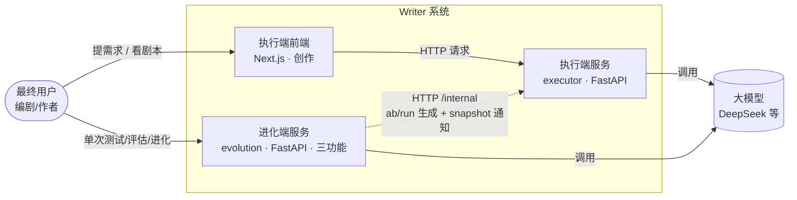
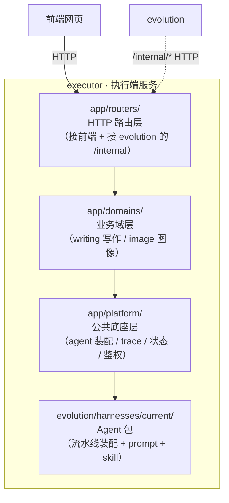
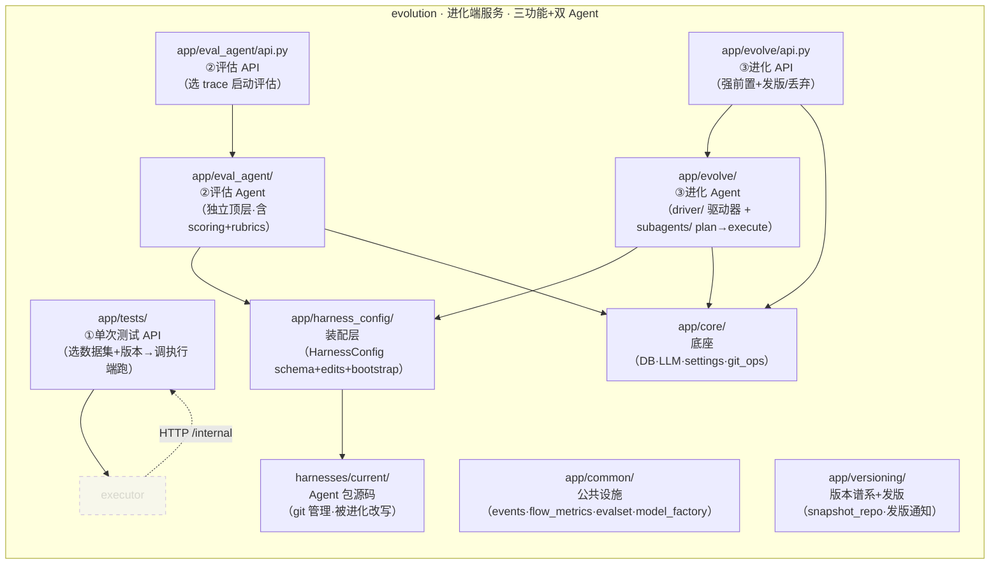
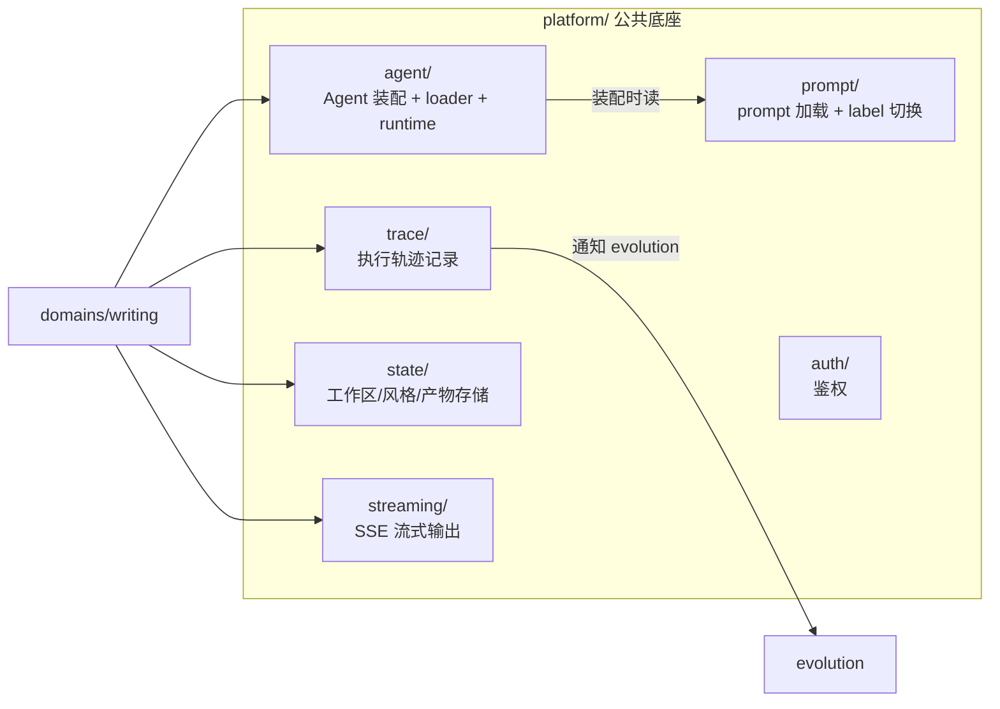
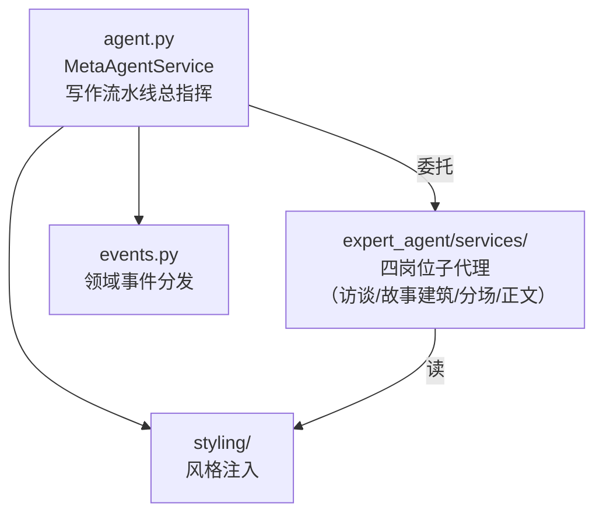
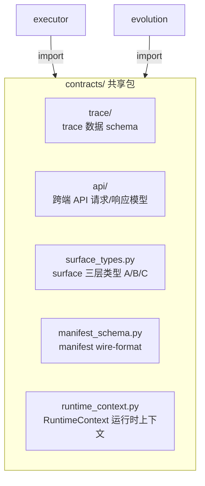
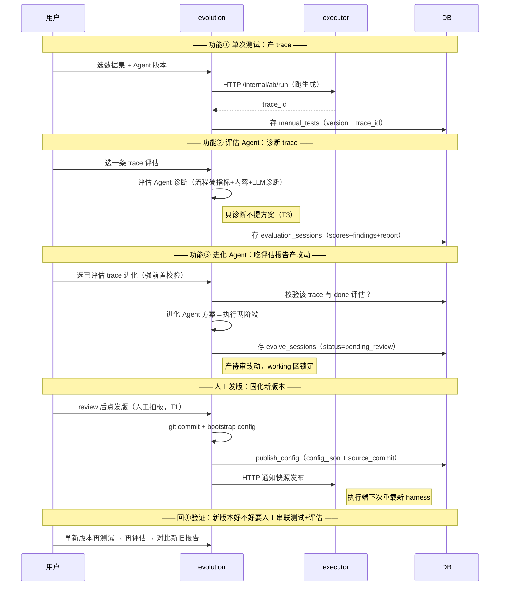

# Writer 架构分层图（C4 模型）

> ⚠️ **本文档已废弃**，由 [`系统心智模型.md`](系统心智模型.md) 取代，不再更新。
> 架构分层、全貌、请求流转、机制深潜请看新的心智模型图。本文件保留作历史归档。

> 这是 docs/ 里专门讲**架构分层**的图。和 [README.md](README.md) 那张「系统全景图」互补：
> README 画的是**模块组成 + 数据流**（部署视角），这里画的是**抽象分层**（架构视角）。
>
> 采用 **C4 模型**——一种「像 Google Earth 一样逐层缩放」的架构表达法：先看大（System Context），
> 再下钻到服务（Container），再下钻到服务内的组件（Component）。每层只讲该层该讲的事，
> 不把细节堆在一起。给非开发也能看懂全景，给开发能查到具体组件。
>
> **本文件是「活文档」**：只反映项目现在的样子，不记变更历史。代码结构变了，对应图要同步。

---

## 这张图解决什么问题

README 的全景图能回答「系统有哪些模块」，但回答不了这两个问题：

1. **想改某功能，该动哪一层、会不会牵连别层？**（分层边界在哪）
2. **系统整体能力是怎么一层层堆出来的？**（抽象怎么堆叠）

C4 的分层表达正好补这个缺。下面按 C4 的层级，从粗到细展开。

---

## L1 · System Context（系统全貌，给所有人看）

> **这一层干什么**：不进任何服务内部，只看「整个系统和谁打交道」。给非技术人也能秒懂。



**一句话**：用户从两个入口使用 Writer——执行端前端做创作，进化端做测试/评估/进化。进化端通过 HTTP /internal 调执行端跑生成，两端**永远走 HTTP，绝不互读文件系统**。

**关键关系**：执行端和进化端之间**永远走 HTTP，绝不互读文件系统**。这是铁律，由 `scripts/check_layering.py` 把关。

---

## L2 · Container（服务容器，给开发看）

> **这一层干什么**：把 L1 里每个服务打开，看它「作为一个可部署单元」的内部组成。
> C4 里「Container」不是 Docker，而是**一个独立运行/部署的进程或前端包**。

### executor（执行端）的容器视图



**分层铁律（check_layering.py 守护）**：

| 层 | 职责 | 能依赖谁 | 不能依赖谁 |
|---|---|---|---|
| **routers/** | 接 HTTP 请求，转给业务域 | domains、platform | 不能写业务逻辑 |
| **domains/** | 业务逻辑（写作流水线、图像） | platform、contracts | 不能直接接路由细节 |
| **platform/** | 所有域共用的基础设施 | contracts、harness 包 | 不能反向依赖 domains |
| **harnesses/current/** | Agent 装配（prompt/skill/流水线编排） | contracts | 被 platform 加载，不反向依赖 |

> **想改功能该动哪层**：
> - 改「用户请求怎么处理」→ `routers/`
> - 改「写作流程怎么编排」→ `domains/writing/` 或 `harnesses/current/`
> - 改「trace 怎么记录、agent 怎么装配」→ `platform/`
> - 改「prompt 内容 / subagent 行为」→ `harnesses/current/`

### evolution（进化端）的容器视图



**evolution 的三功能（解耦后各自独立，人工串联闭环）**：

| 功能 | 入口 | Agent | 干什么 |
|---|---|---|---|
| **①单次测试** | `app/tests/` | 无（调执行端） | 选数据集+Agent版本 → 调 executor 跑生成 → 产 trace，不自动进化 |
| **②评估系统** | `app/eval_agent/` | 评估 Agent（独立顶层） | 对一条 trace 做诊断（流程硬指标+内容评分+LLM 诊断），**只诊断不提方案**，产出评估报告 |
| **③进化系统** | `app/evolve/` | 进化 Agent（驱动器+2子代理） | 吃评估报告（强前置）→ 方案→执行 → 产待审改动 → **人工发版**（不自证比分） |

> **双 Agent 对等**：评估 Agent 和进化 Agent 是两个独立的顶层 Agent，通过 DB（evaluation_sessions 表）交接数据，不共享内存。评估只诊断，方案设计归进化。发版靠人工拍板（tar/config_json + git commit 快照）。

---

## L3 · Component（组件级，给开发深入查）

> **这一层干什么**：进到某个层里，看它由哪些关键组件组成、谁调谁。
> 这里挑「最容易被改、最需要看清边界」的几块展开。

### executor · platform/ 内部组件（最常被改的底座）



**平台层最核心的一条链**（画这张图就是为了让你改 platform 时心里有数）：

```
domains/writing/agent.py (MetaAgentService)
  → platform/agent/loader.py (load_current_package)   # 加载 harness 包
  → harness 包的 assemble(ctx)                          # 包内自己装配 agent
  → platform/streaming/ (run_agent_stream)             # SSE 流式跑
  → platform/trace/ (TraceRecorder)                    # 全程记 trace
```

### executor · domains/writing/ 写作域（业务核心）



### contracts/ 共享契约（两端的数据合同）



**铁律**：contracts **只被依赖，不依赖任何一端**（不 import executor 也不 import evolution）。违反会被 `check_layering.py` 拦。

**surface 三层（理解 harness 包怎么被「安全进化」的关键）**：

| 层 | 含义 | 改它的影响 | 例子 |
|---|---|---|---|
| **A_TEXT** | 纯文本 | 不改 State schema，可自由进化、A/B | prompt / skill_md / description |
| **B_PARAM** | JSON 参数 | 改行为，可能不改 schema，校验后可进化 | middleware_params / permissions |
| **C_CODE** | 受限 Python | 改 State schema，全闸 + 锁 schema 版本 | 带 state_schema 的 middleware |

---

## L4 · 三功能进化闭环（端到端，把分层串起来）

> **这一层干什么**：上面三张图是「静态结构」，这张是「动态流程」——
> 三功能（单次测试→评估→进化）怎么各自独立、人工串联成一个完整闭环。



**这张图的价值**：三功能各自独立、不串入对方流程。用户手动串联闭环——测试产 trace → 评估诊断 → 进化产版本 → 人工发版 → 回测试验证。下次想改某个环节（评估维度？发版机制？强前置校验？），照这张图定位改哪里。

---

## 怎么用这张图

| 你的场景 | 看哪一层 |
|---|---|
| 给非技术人讲系统全貌 | L1（System Context） |
| 想改功能，先定位动哪层 | L2（Container）+ 分层铁律表 |
| 改 platform 底座 | L3 · platform 内部 |
| 改写作流水线 | L3 · writing 域 |
| 改跨端联动 / trace 回灌 | L4（进化闭环） |
| 改 harness 怎么被进化 | L3 · surface 三层 + L4 |

---

## 维护说明

- 本图遵循 `CLAUDE.md` 文档同步铁律：**改了分层结构、新增/删除层或组件，必须同步本图**。
- 图用 **Mermaid** 画（GitHub 原生渲染，无需额外工具）。
- 图里的「层名 / 组件名」必须和实际代码目录名对齐，不准用别名。
