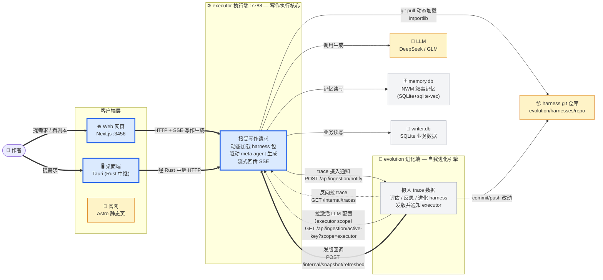
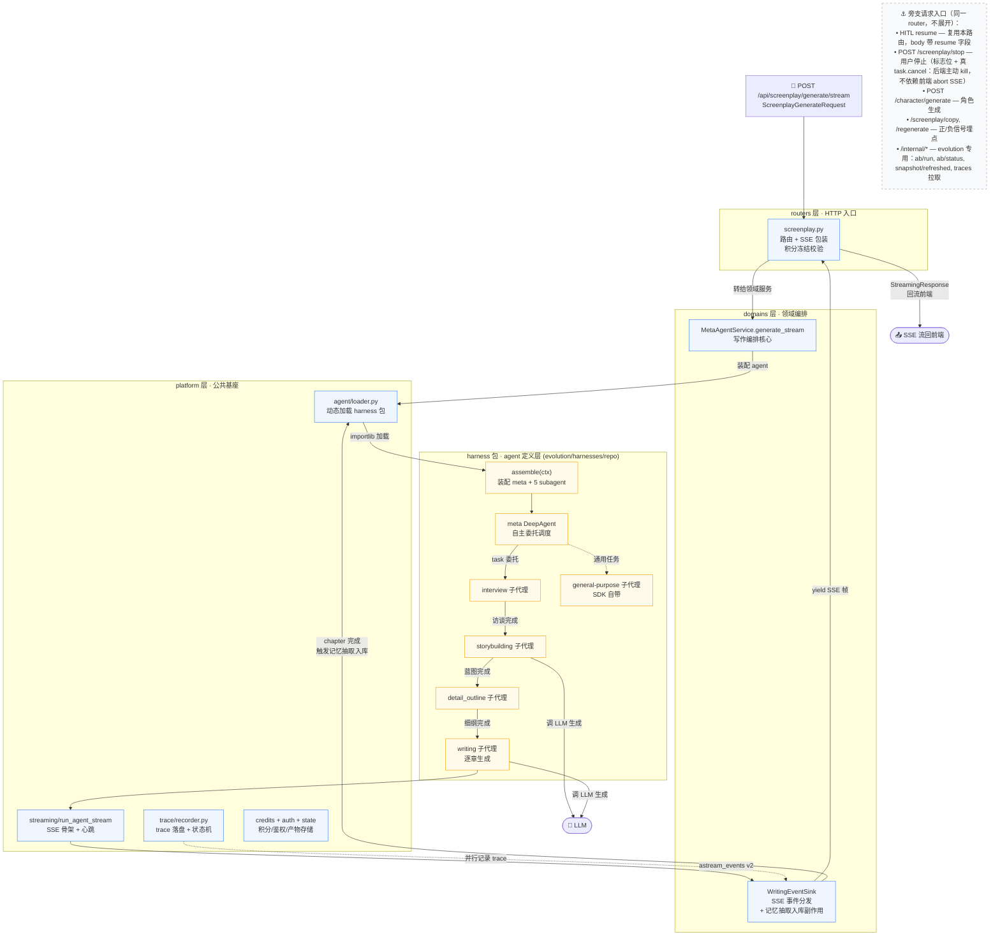
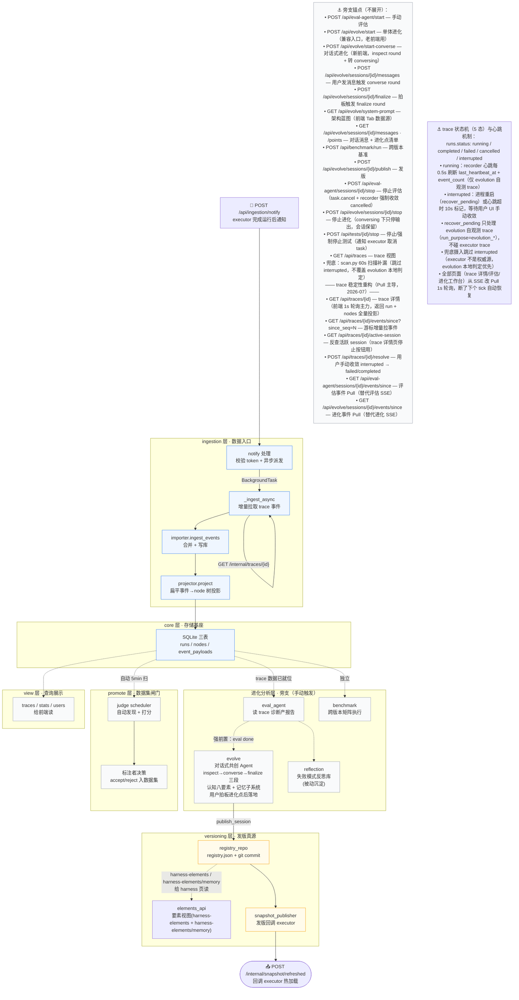
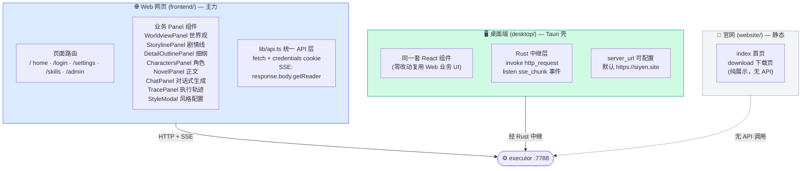
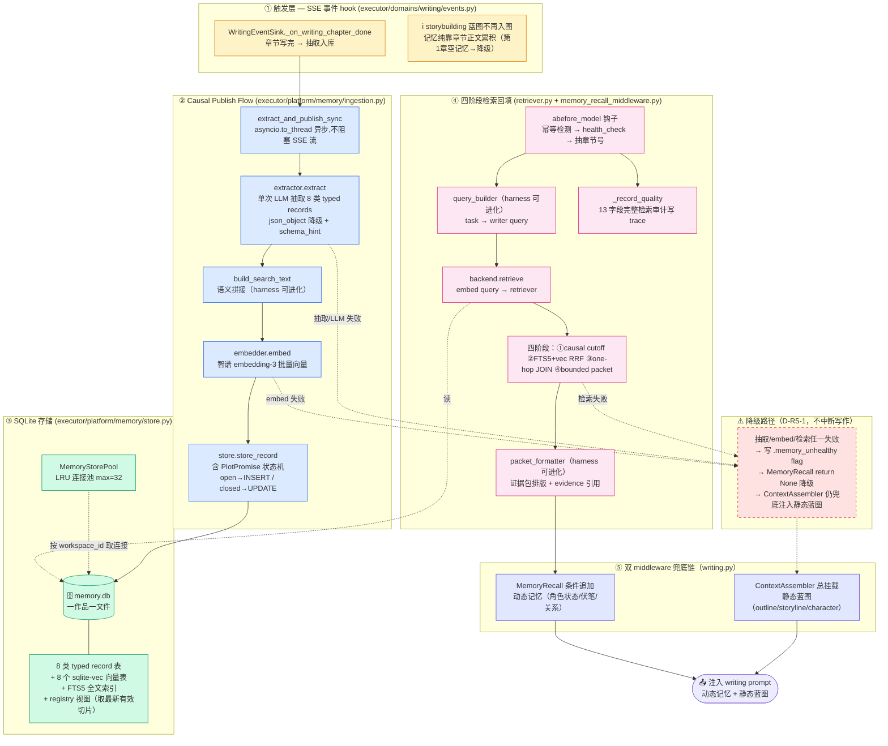
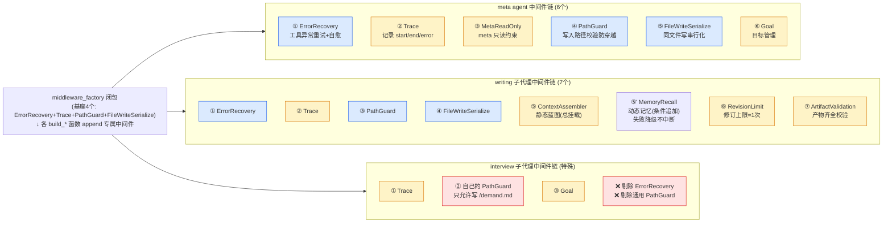
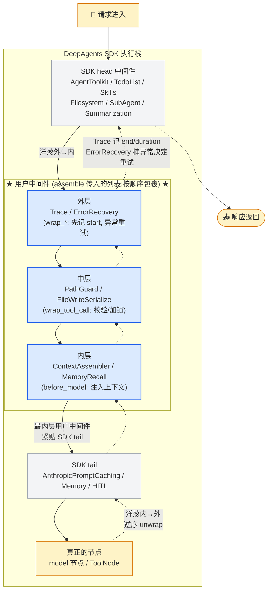
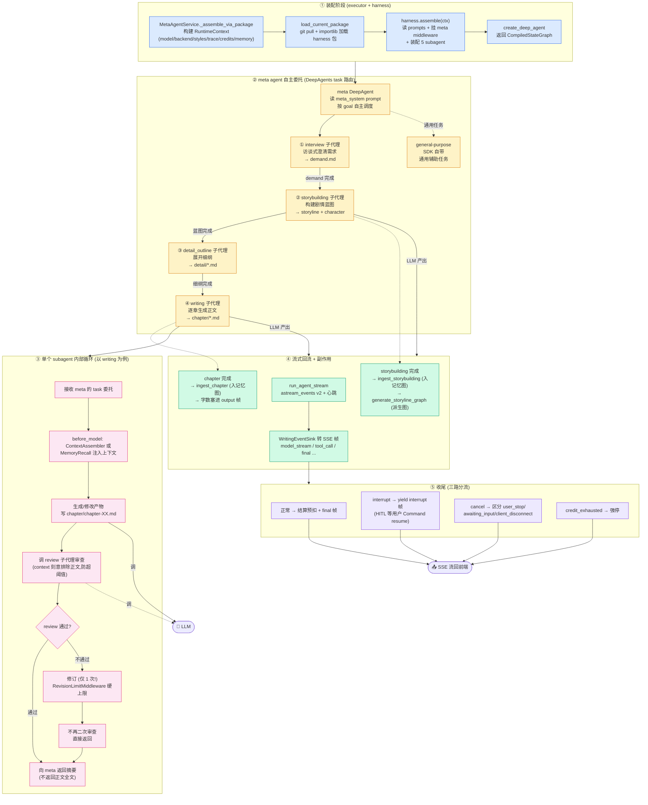

# Writer 系统心智模型

> **本文档是 Writer 系统的唯一文档真相源**，用 7 张 Mermaid 图把整个系统"分层下钻"地画出来——
> 从全局协作全貌，到端级请求流，再到核心机制的内部运转。
> 供开发者长期参考，把系统全貌装进脑子。
>
> **读法**：按章顺序读。第一章看全貌，第二章看每个端怎么运转，第三章深潜三个核心机制。
> 每章开头有"本章回答什么问题"，每张图旁边有层标注和旁支锚点。
>
> **维护规则**：改了代码，必须同步更新本文档对应的图（见 `AGENTS.md` 文档同步铁律）。

---

## 导航

| 章节 | 图 | 回答什么问题 |
|------|-----|------------|
| **第一章 · 全局视图** | 图 1 系统总览 | 整个系统有哪些部分？一次写作请求的完整旅途？ |
| **第二章 · 端级视图** | 图 2 executor 端级 | 写作生成请求穿过 executor 哪些组件？ |
| | 图 3 evolution 端级 | trace 摄入请求穿过 evolution 哪些组件？ |
| | 图 4 前端 | 前端有哪些模块？怎么调后端？ |
| **第三章 · 机制深潜** | 图 5 memory 闭环 | 记忆怎么收集、入图、回填？ |
| | 图 6 harness 中间件 | 中间件怎么动态组装、怎么执行？ |
| | 图 7 writing 生成流程 | 一个写作请求内部怎么从装配到产出？ |

**图之间的下钻关系**：图 1 总览 → 图 2/3/4 端级细节 → 图 5/6/7 机制深潜。
主线贯穿三张图的是同一个东西：**一次写作生成请求**。

---

# 第一章 · 全局视图

> **本章回答**：整个系统有哪些部分？它们怎么协作？一次写作请求的完整旅途长什么样？
>
> 这是唯一的系统全貌入口。先在脑子里建立这张图，再往下钻细节。

## 图 1 · 系统总览

三端 + 外部依赖的全景。**主线（粗箭头）是一次写作生成请求的完整旅途**，
细箭头是进化闭环的回流。

**三个关键认知（看这张图记住这三点）：**

1. **executor 是绝对核心**。前端只碰它，它直连 LLM / memory.db（NWM 记忆） / writer.db。
2. **evolution 是"幕后进化引擎"**，不直接服务用户——它摄入 executor 的 trace，
   基于此评估、进化 harness 包，发版后回调 executor 热加载。
3. **harness 包是连接两端的纽带**：executor 动态加载它当 agent 定义，
   evolution 改它并 push——**同一个包，一端读一端写**。

**客户端层有三个前端**（别混）：
- `Web 网页`（Next.js，主力）和 `桌面端`（Tauri 壳包同一套 React 组件）都调 executor
- `官网`（Astro）是纯静态下载页，**不调任何 API**

---

# 第二章 · 端级视图

> **本章回答**：请求进入每个端后，穿过哪些组件？每个端内部怎么组织？
>
> 三张端级图都以"请求流"为主线（横向箭头 = 请求穿过），
> 节点旁标所属层（`〔层名〕`），旁支功能只留锚点不展开。

## 图 2 · executor 端级 — 写作生成请求流

主线：`POST /api/screenplay/generate/stream` 一次完整请求穿过的组件链。
纵向 subgraph 是代码分层，请求从上往下流。

**executor 的四层架构（纵向看 subgraph）**：

| 层 | 职责 | 关键模块 |
|----|------|---------|
| **routers** | HTTP 入口，接前端 + 接 evolution | screenplay / character / threads / workspaces / internal |
| **domains** | 领域编排（writing / image） | MetaAgentService / WritingEventSink |
| **platform** | 领域无关基座 | agent / streaming / trace / credits / auth / state / memory / ... |
| **harness 包** | agent 定义（动态加载，不在 executor 仓库） | assemble / subagents / middleware / prompts / skills |

**层依赖铁律**：platform 不 import domain；domain 可 import platform；
harness 包依赖 platform.runtime 和 contracts，运行时值全由 ctx 注入。

**看这张图记两点**：
1. 写作生成不是一条直线——`MetaAgentService` 装配后，**meta agent 自主委托 5 个 subagent**
   （interview→storybuilding→detail_outline→writing），每个内部还有 review-revise 循环（详见 图 7）。
2. `WritingEventSink` 不只转 SSE——它还**在 chapter 完成时触发记忆抽取入库**（详见 图 5）。

---

## 图 3 · evolution 端级 — trace 摄入请求流

主线：executor 完成 trace 后通知 evolution → 摄入 → 投影 → 存储。
进化分析（eval/evolve/benchmark）是**旁支**（手动触发，独立于摄入）。

**evolution 各层一句话**：

| 层 | 作用 |
|----|------|
| **ingestion** | 唯一数据入口。notify 拉取 + 增量投影 + 兜底扫描 |
| **core** | SQLite 共享基座（三表 + 业务表 + 鉴权） |
| **eval_agent** | 独立评估 Agent，读 trace 产 findings/scores 报告 |
| **evolve** | 对话式共创 Agent（inspect→converse→finalize 三段），与用户多轮对齐进化点后落地，产 pending_review |
| **benchmark** | 跨版本 case×version 矩阵执行，产 leaderboard |
| **reflection** | 失败模式反思库（Reflexion 式），进化时按 dimension 查注入 |
| **promote** | 生产 trace → growing 数据集的清洗闸门（自动 judge + 人工标注） |
| **versioning** | harness 版本注册表（registry.json + git）+ 发版回调 |
| **view** | 查询展示路由，给前端读 |

**看这张图记两点**：
1. **摄入和进化是解耦的**——摄入只把 trace 存进 SQLite，不触发任何评估。
   评估/进化全是独立手动触发（唯一自动的是 promote judge scheduler，5 分钟扫一次）。
2. **发版闭环**：evolve 产改动 → publish → 更新 registry.json + git push → 回调 executor 清缓存热加载。

---

## 图 4 · 前端 — 模块维度（粗略）

前端有三个独立应用，业务核心集中在 Web 版的 Panel 组件。
**所有业务请求只打 executor，零调 evolution。**

**前端三个应用的区别**：

| 应用 | 角色 | 调后端 |
|------|------|--------|
| **Web 网页** (`frontend/`) | 主力应用，Next.js 15 | ✅ 直连 executor |
| **桌面端** (`desktop/`) | Tauri 壳包同一套 React 组件，Rust 做 HTTP/SSE 中继 | ✅ 经 Rust 连 executor |
| **官网** (`website/`) | Astro 静态下载页 | ❌ 无任何 API 调用 |

**为什么桌面端要 Rust 中继**：让 Web 版的 ~60 处业务调用**零改动**，
只换底层 transport（fetch → invoke + Tauri event）。桌面端默认连云端 `siyen.site`。

> **注意区分两个 desktop/**：上面说的是**创作端**桌面 App（根目录 `desktop/`，连 executor）。
> **进化端**也有自己的桌面 App（`evolution/desktop/`，连 evolution 的 `/evolution-api`），
> 是 evolution 监测/评估/进化操作的唯一入口。evolution 原 web 版（`evolution/frontend/`，Next.js）
> 已废弃删除——监测端只通过桌面 App 访问，不再提供浏览器 web 端。
>
> **进化端桌面侧栏结构**（2026-07-18 scope 分家后）：
> - 基础 8 项（所有用户）：监测 / 历史 / 评估 / 进化 / Harness 要素 / 版本谱系 / 数据集 / 单次测试
> - 超管专属 3 项：**进化端模型** 🧠（评估 Agent 用 LLM）/ **执行端模型** ✍️（executor 写作用 LLM）/ **管理后台** 🛡️（tab 化：用户 / 邀请码 / 积分流水 / 积分设置）
> - "进化端模型"和"执行端模型"背后是同一张 `llm_configs` 表的 `scope` 维度分家——
>   `scope='evolution'` 给评估用，`scope='executor'` 给写作用，各自独立激活。executor 通过
>   `GET /api/ingestion/active-key?scope=executor` 拉写作侧配置（60s TTL 缓存）。
>
> **「进化」页双 Tab 工作台**（Phase 4 重写，2026-07-19）：
> - **Tab 1「进化工作台」**：三栏布局——左侧历史会话 / 中部对话区（启动入口 + 消息流 + 输入框）/ 右侧进化点浮窗（按状态分组 + 拍板按钮 + 双向高亮联动）。
> - **Tab 2「架构蓝图」**：只读展示进化 Agent 系统提示词（7 段全景 + 对创作 Agent 的理解），后端 `GET /api/evolve/system-prompt` 动态返回。
> - 对话式共创流程：`POST /start-converse`（inspect round）→ `POST /messages`（多轮 converse round，Agent 用 propose/update/reject 工具维护进化点）→ `POST /finalize`（拍板，generate_design_doc_from_points + finalizing round）→ pending_review → review-report 页发布/丢弃。
> - 老入口 `POST /start`（单体一气呵成）保留兼容，新前端走 `/start-converse`。

---

# 第三章 · 机制深潜

> **本章回答**：三个核心机制——记忆闭环、harness 中间件、写作生成——内部到底怎么转？
>
> 这是系统最微妙的三处。每张图都画到"输入→变换→输出"的机制原理级，
> 带数据形态变化和跨组件时序。

## 图 5 · memory 闭环 — NWM 叙事学类型化记忆（executor 进程内自洽）

**⚠️ 重要纠偏**：记忆系统**不是** executor→evolution 的跨端调用，也**不再依赖 Graphiti/FalkorDB**。
记忆的抽取、存储、检索、回填**全在 executor 进程内**完成，存储用 **SQLite + sqlite-vec + FTS5**（一作品一个 memory.db 文件）。
evolution 只贡献"可进化的 schema/query_builder/join_rules/formatter/prompt"（作为 harness 包被动态加载），
不存记忆数据。

**NWM（Narrative World Model）核心**：记忆不是 generic entity/edge 图，而是 **8 类 typed records**
（CharacterState 角色状态 / PlotPromise 伏笔承诺 / NarrativeFunction 叙事功能 / Scene 场景 /
RelationshipState 关系 / ObjectState 物品 / WorldFact 设定 / ChapterDigest 摘要）。
每条带 source_chapter（因果锚点）+ evidence_span（原文引用）+ valid_at/invalid_at（有效期）。

**闭环的四段（对应图中四色）**：

| 段 | 触发 | 做什么 | 关键文件 |
|----|------|--------|---------|
| **①② 写入（Publish）** | writing 章节完成的 SSE 事件 | 章节正文 → LLM 抽取 8 类 typed records → 语义拼接 → embed → 存 SQLite（含 PlotPromise 状态机） | events.py → ingestion.py → extractor.py → store.py |
| **③ 存储** | SQLite 单文件 | 一作品一 memory.db：8 类 record 表 + sqlite-vec 向量表 + FTS5 + registry 视图（valid_at/invalid_at 取最新有效切片） | store.py → MemoryStorePool |
| **④ 检索（Retrieve）** | writing 子代理调 LLM 前 | 四阶段：causal cutoff（source_chapter≤N-1）→ FTS5+vec RRF 混合排序 → one-hop JOIN 扩展 → bounded packet | retriever.py → backend.py |
| **⑤ 回填** | writing 子代理调 LLM 前 | 动态记忆注入 prompt（与 ContextAssembler 静态蓝图互补共存） | memory_recall_middleware.py |

**四个反直觉点（看这张图必须记住）**：

1. **不依赖 Graphiti/FalkorDB**。记忆是自研 NWM——SQLite 存 typed records，sqlite-vec 存向量，
   FTS5 做 BM25，SQL JOIN 做 one-hop 图扩展。图库的"generic entity/edge"被换成"8 类叙事学类型化 record"。
2. **8 类 typed records 是 NWM 的灵魂**（论文碾压 Graphiti 的关键）：
   - CharacterState（谁知什么——信息差追踪）
   - PlotPromise（伏笔 open/closed 状态机——挖坑填坑追踪）
   - NarrativeFunction（视角/读者知晓——dramatic irony 基础）
   这三类正是 Graphiti 的 generic schema 无法表达的。
3. **因果锚点是章节号，不是时间戳**。每条 record 带 source_chapter，写第 N+1 章检索时
   `source_chapter ≤ N`（杜绝未来章节泄漏）。放弃 wall-clock 和故事内时间（论文也不用）。
4. **双 middleware 兜底链（D-D5-1）**：ContextAssembler（静态蓝图）总挂载 + MemoryRecall（动态记忆）
   条件追加。两者前缀不同（"写作前置上下文：" vs "记忆召回："），互补共存。
   MemoryRecall 失败 → return None 降级，ContextAssembler 仍兜底，writing 永不零上下文。

**harness 可进化要素**（evolution agent 能改，改完 assemble 注入立即生效）：
- `tools/narrative_schema.py` — 8 类 record 元信息 + 题材→record 映射策略
- `tools/query_builder.py` — task → writer query 构造
- `tools/join_rules.py` — one-hop JOIN 扩展规则
- `tools/packet_formatter.py` — 证据包排版
- `prompts/memory_extraction_guide.md` — 抽取 prompt
- `middleware/memory_recall_middleware.py` — 检索编排 + 失败降级 + 引导语

**P4 进化闭环**：`_record_quality` 把每次检索的**完整审计**（13 字段：causal_cutoff/stage1_count/
stage2_anchors/stage3_expanded/truncated/hits 摘要等）写进 trace run_meta，
这是 evolution 评估记忆系统效果、驱动记忆要素进化的信号源——能看到"召回了什么"而非仅"召回了几个"。

---

## 图 6 · harness 中间件 — 动态组装 + 洋葱执行

**⚠️ 重要纠偏**：中间件**不是**固定的一条链。它**按 agent 类型动态组装**，
不同 agent 的中间件列表完全不同。执行模型是 DeepAgents 的**洋葱中间件**——
不同 hook 在 graph 不同节点生效，不是单一管道。

### 6a · 组装规则 — 谁、挂哪些、什么顺序

**组装规则**：每个 agent 的中间件 = **基座 4 个**（middleware_factory 闭包产出）
+ **各自 build_* 函数动态 append 专属中间件** + Trace/Credits 用 `insert(1,...)` 紧跟 ErrorRecovery 之后。

### 6b · 洋葱执行模型 — 请求怎么穿过链

**洋葱模型的关键**：不同 hook 在不同 graph 节点生效，**"链"不是单一管道**：

| Hook 类型 | 生效节点 | 哪些中间件用 | 作用 |
|-----------|---------|-------------|------|
| `wrap_tool_call` | ToolNode | ErrorRecovery / PathGuard / FileWriteSerialize / Trace | 校验、加锁、重试、观察 |
| `wrap_model_call` + `before_model` | model 节点 | ContextAssembler / MemoryRecall / Trace | 注入上下文、稳定缓存 |
| `after_model` | model 节点后 | ArtifactValidation | 检查产物缺失→弹回 model |
| `before_agent` | agent 入口 | ArtifactPrerequisite | 校验前置产物存在 |

**ContextAssembler 为什么排最内层**：它要最后定稿送给 model 的消息顺序，
必须晚于上游所有 wrap，紧贴 AnthropicPromptCaching 之前，才能保证缓存前缀稳定。

**两条组装路径**：
- **硬编码**（config=None）：顺序固定如上表
- **配置驱动**（有 config）：middleware 列表由 `build_middleware_list(processors, ctx)` 从 config 构建

---

## 图 7 · writing 生成流程 — 装配 + 委托 + 循环

**⚠️ 重要纠偏**：`expert_agent/services/` 是**空壳**。真正的 agent 定义在外部 harness 包里，
executor 运行时动态加载。写作生成不是一条直线，是 **meta agent 自主委托 5 个 subagent**，
每个 subagent 内部还有 **review-revise 循环**。

**写作生成的五个阶段（对应图中五色）**：

| 阶段 | 做什么 | 归属 |
|------|--------|------|
| **① 装配** | 构建 RuntimeContext + 动态加载 harness + 装配 agent | executor + harness |
| **② 委托** | meta agent 按 goal 自主委托 interview→storybuilding→detail_outline→writing | harness (subagents/) |
| **③ 循环** | 每个 subagent 内部：生成→review→(修订1次)→返回摘要 | harness (factory.py) |
| **④ 回流** | SSE 流式回前端 + 在关键节点触发记忆入图/派生图副作用 | executor (streaming + events) |
| **⑤ 收尾** | 正常/interrupt/cancel/credit_exhausted 四路分流 | executor (agent.py) |

**三个关键认知**：

1. **meta 是自主的，不是硬编码编排**。meta agent 读 meta_system prompt 后自己决定
   调哪个 subagent、什么时候调。典型顺序是 interview→storybuilding→detail_outline→writing，
   但这是涌现行为，不是 if-else。
2. **review-revise 循环有硬上限（1 次）**。`RevisionLimitMiddleware` 强制 writing 子代理
   最多修订一次，且修订后**不再二次审查**——防止无限循环。
3. **副作用只能放 WritingEventSink，不能放 middleware**。因为 middleware 抓不到
   DeepAgents subagent task 调度事件——只有 sink 能在 storybuilding/chapter 完成时
   触发记忆入图和派生图生成。

**styling 是前置配置，不在生成流里跑**：`domains/writing/styling/` 在装配阶段（①）
被消费——从 store 读激活风格的 4 个字段，填进 ctx.styles，包内 `apply_style_suffix`
追加到各 subagent 的 system_prompt 末尾。

---

## 附 · 关键文件索引

> 废弃文件大地图后，单文件查阅改用此索引 + 心智模型图反推定位。

| 模块 | 关键文件 |
|------|---------|
| **写作编排** | executor/app/domains/writing/agent.py, events.py |
| **harness 装配** | evolution/harnesses/repo/__init__.py |
| **中间件** | executor/app/platform/agent/middleware/ + evolution/harnesses/repo/middleware/ |
| **记忆系统** | executor/app/platform/memory/ + evolution/harnesses/repo/middleware/memory_recall_middleware.py |
| **SSE 流式** | executor/app/platform/streaming/event_stream.py |
| **trace 子系统** | executor/app/platform/trace/recorder.py |
| **trace 摄入** | evolution/app/ingestion/ |
| **进化引擎** | evolution/app/evolve/, eval_agent/, benchmark/, reflection/ |
| **发版** | evolution/app/versioning/ |
| **前端 API** | frontend/lib/api.ts, desktop/src/lib/api.ts |

---
