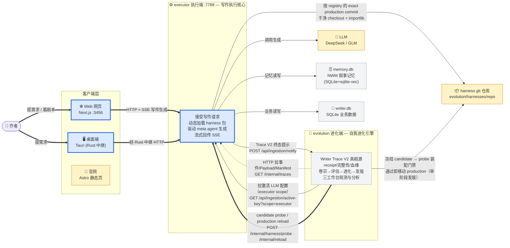
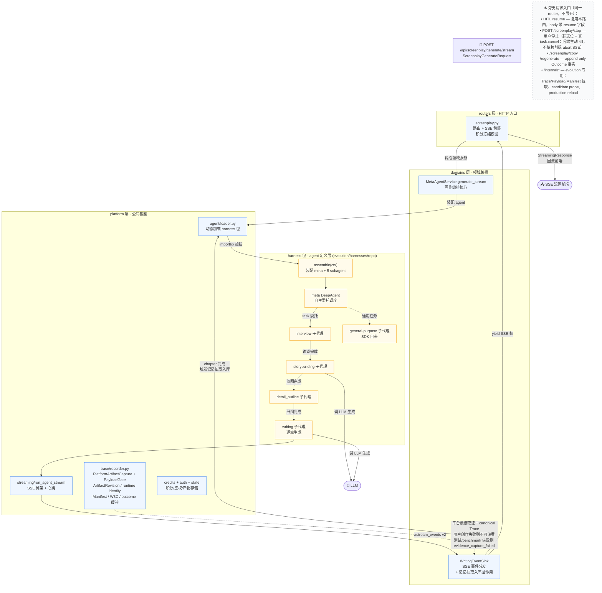
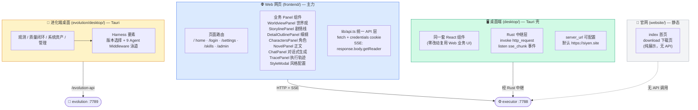
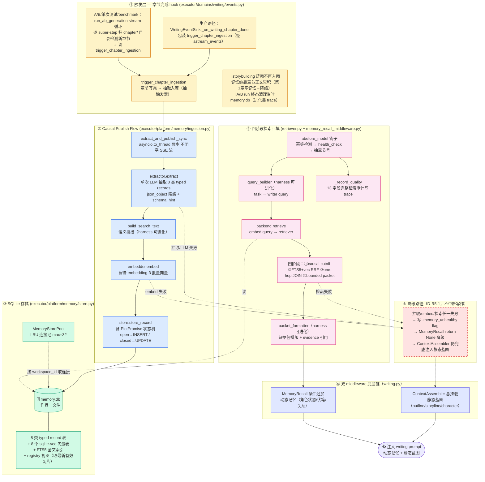
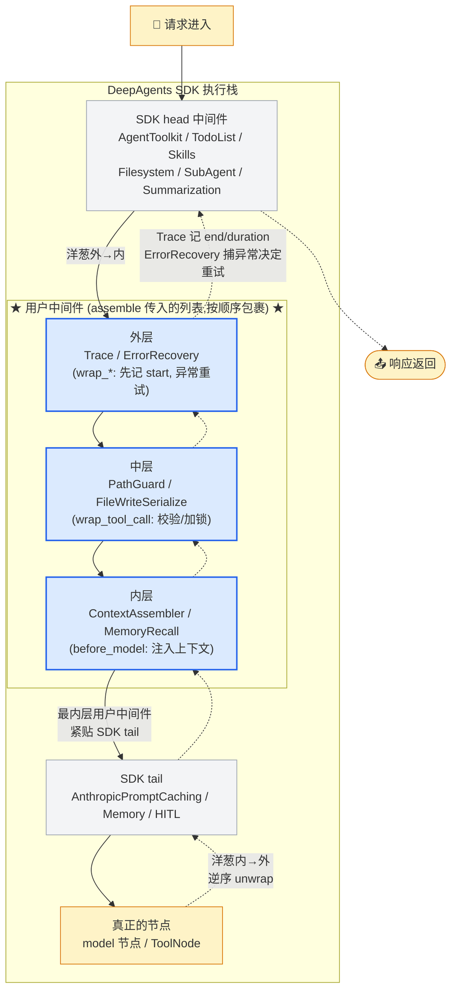
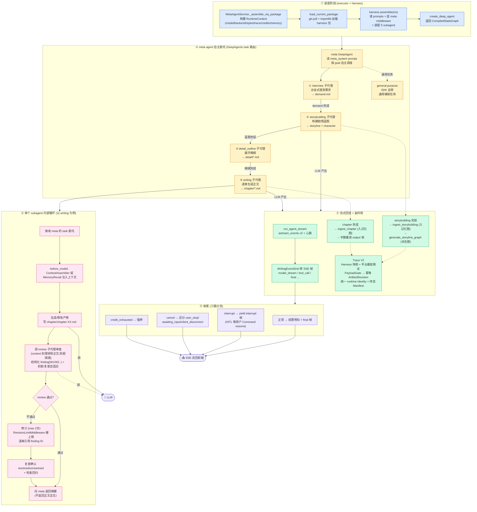

# Writer 系统心智模型

> **本文档是 Writer 系统的唯一文档真相源**，用 7 张 Mermaid 图把整个系统"分层下钻"地画出来——
> 从全局协作全貌，到端级请求流，再到核心机制的内部运转。
> 供开发者长期参考，把系统全貌装进脑子。
>
> **读法**：按章顺序读。第一章看全貌，第二章看每个端怎么运转，第三章深潜三个核心机制。
> 每章开头有"本章回答什么问题"，每张图旁边有层标注和旁支锚点。
>
> **维护规则**：改了代码，必须同步更新本文档对应的图（见 `AGENTS.md` 文档同步铁律）。

---

## 导航

| 章节 | 图 | 回答什么问题 |
|------|-----|------------|
| **第一章 · 全局视图** | 图 1 系统总览 | 整个系统有哪些部分？一次写作请求的完整旅途？ |
| **第二章 · 端级视图** | 图 2 executor 端级 | 写作生成请求穿过 executor 哪些组件？ |
| | 图 3 evolution 端级 | trace 摄入请求穿过 evolution 哪些组件？ |
| | 图 4 前端 | 前端有哪些模块？怎么调后端？ |
| **第三章 · 机制深潜** | 图 5 memory 闭环 | 记忆怎么收集、入图、回填？ |
| | 图 6 harness 中间件 | 中间件怎么动态组装、怎么执行？ |
| | 图 7 writing 生成流程 | 一个写作请求内部怎么从装配到产出？ |

**图之间的下钻关系**：图 1 总览 → 图 2/3/4 端级细节 → 图 5/6/7 机制深潜。
主线贯穿三张图的是同一个东西：**一次写作生成请求**。

---

# 第一章 · 全局视图

> **本章回答**：整个系统有哪些部分？它们怎么协作？一次写作请求的完整旅途长什么样？
>
> 这是唯一的系统全貌入口。先在脑子里建立这张图，再往下钻细节。

## 图 1 · 系统总览

三端 + 外部依赖的全景。**主线（粗箭头）是一次写作生成请求的完整旅途**，
细箭头是进化闭环的回流。

```mermaid
flowchart LR
    Author(["👤 作者"])

    subgraph Clients["客户端层"]
        Web["🌐 Web 网页<br/>Next.js :3456"]
        Desk["🖥️ 桌面端<br/>Tauri (Rust 中继)"]
        Site["📄 官网<br/>Astro 静态页"]
    end

    subgraph EX["⚙️ executor 执行端 :7788 — 写作执行核心"]
        direction TB
        EX_Core["接受写作请求<br/>动态加载 harness 包<br/>驱动 meta agent 生成<br/>流式回传 SSE"]
    end

    subgraph EV["🔬 evolution 进化端 — 自我进化引擎"]
        direction TB
        EV_Core["Writer Trace V2 真相源<br/>receipt/完整性/血缘<br/>卷宗→评估→进化→发版<br/>三工作台观测与分析"]
    end

    LLM["🤖 LLM<br/>DeepSeek / GLM"]
    MemDB["🗄️ memory.db<br/>NWM 叙事记忆<br/>(SQLite+sqlite-vec)"]
    DB["💾 writer.db<br/>SQLite 业务数据"]
    GitRepo["📦 harness git 仓库<br/>evolution/harnesses/repo"]

    %% 主线：写作生成全旅途（粗箭头）
    Author ==>|"提需求 / 看剧本"| Web
    Author ==>|"提需求"| Desk
    Web ==>|"HTTP + SSE 写作生成"| EX_Core
    Desk ==>|"经 Rust 中继 HTTP"| EX_Core

    %% executor 调外部
    EX_Core -->|"调用生成"| LLM
    EX_Core -->|"记忆读写"| MemDB
    EX_Core -->|"业务读写"| DB

    %% 进化闭环：executor ↔ evolution
    EX_Core -->|"Trace V2 终态提示<br/>POST /api/ingestion/notify"| EV_Core
    EV_Core -.->|"HTTP 拉事件/Payload/Manifest<br/>GET /internal/traces"| EX_Core
    EV_Core -->|"拉激活 LLM 配置（executor scope）<br/>GET /api/ingestion/active-key?scope=executor"| EX_Core
    EV_Core ==>|"candidate probe / production reload<br/>POST /internal/harness/probe · /internal/reload"| EX_Core

    %% harness 包加载
    EX_Core -->|"按 registry 的 exact production commit<br/>干净 checkout + importlib"| GitRepo
    EV_Core -->|"冻结 candidate → probe 装配门禁<br/>通过即移动 production（单阶段发版）"| GitRepo

    %% 官网独立
    Site

    classDef main fill:#dbeafe,stroke:#2563eb,stroke-width:3px
    classDef side fill:#f3f4f6,stroke:#9ca3af
    classDef ext fill:#fef3c7,stroke:#d97706

    class Web,Desk,EX_Core main
    class EV_Core,DB,MemDB side
    class LLM,GitRepo,Site ext
```

**三个关键认知（看这张图记住这三点）：**

1. **executor 是绝对核心**。前端只碰它，它直连 LLM / memory.db（NWM 记忆） / writer.db。
2. **evolution 是开发与质量人员使用的幕后进化引擎**。它以一套 canonical Trace
   记录创作与内部工作负载；创作、证据编译、评估、进化各自独立 Trace，异步因果只用
   Link 和不可变制品版本关联，绝不伪造跨服务父子 Span。
3. **harness 包是连接两端的纽带**：evolution 冻结不可变 candidate；executor 从该
   exact commit 真实装配做 probe。probe 通过即晋升 production（单阶段发版——
   Harness commit、executor 装配、ArtifactSnapshotMiddleware 齐全即放行，不再要求
   snapshot trace + 证据卷宗 + 评估卷宗三件套）；reload 失败会恢复原指针并重新加载旧 production。

**客户端层有三个前端**（别混）：
- `Web 网页`（Next.js，主力）和 `桌面端`（Tauri 壳包同一套 React 组件）都调 executor
- `官网`（Astro）是纯静态下载页，**不调任何 API**

---

# 第二章 · 端级视图

> **本章回答**：请求进入每个端后，穿过哪些组件？每个端内部怎么组织？
>
> 三张端级图都以"请求流"为主线（横向箭头 = 请求穿过），
> 节点旁标所属层（`〔层名〕`），旁支功能只留锚点不展开。

## 图 2 · executor 端级 — 写作生成请求流

主线：`POST /api/screenplay/generate/stream` 一次完整请求穿过的组件链。
纵向 subgraph 是代码分层，请求从上往下流。

```mermaid
flowchart TD
    Req["📨 POST /api/screenplay/generate/stream<br/>ScreenplayGenerateRequest"]

    subgraph L_Routers["routers 层 · HTTP 入口"]
        R1["screenplay.py<br/>路由 + SSE 包装<br/>积分冻结校验"]
    end

    subgraph L_Domains["domains 层 · 领域编排"]
        D1["MetaAgentService.generate_stream<br/>写作编排核心"]
        D2["WritingEventSink<br/>SSE 事件分发<br/>+ 记忆抽取入库副作用"]
    end

    subgraph L_Platform["platform 层 · 公共基座"]
        P1["agent/loader.py<br/>动态加载 harness 包"]
        P2["streaming/run_agent_stream<br/>SSE 骨架 + 心跳"]
        P3["trace/recorder.py<br/>PlatformArtifactCapture + PayloadGate<br/>ArtifactRevision / runtime identity<br/>Manifest / W3C / outcome 缓冲"]
        P4["credits + auth + state<br/>积分/鉴权/产物存储"]
    end

    subgraph L_Harness["harness 包 · agent 定义层 (evolution/harnesses/repo)"]
        H1["assemble(ctx)<br/>装配 meta + 5 subagent"]
        Meta["meta DeepAgent<br/>自主委托调度"]
        Sub1["interview 子代理"]
        Sub2["storybuilding 子代理"]
        Sub3["detail_outline 子代理"]
        Sub4["writing 子代理<br/>逐章生成"]
        Sub5["general-purpose 子代理<br/>SDK 自带"]
    end

    LLM(["🤖 LLM"])

    %% 主线
    Req --> R1
    R1 -->|"转给领域服务"| D1
    D1 -->|"装配 agent"| P1
    P1 -->|"importlib 加载"| H1
    H1 --> Meta
    Meta -->|"task 委托"| Sub1
    Sub1 -->|"访谈完成"| Sub2
    Sub2 -->|"蓝图完成"| Sub3
    Sub3 -->|"细纲完成"| Sub4
    Meta -.->|"通用任务"| Sub5
    Sub4 --> P2
    Sub2 & Sub4 -->|"调 LLM 生成"| LLM

    %% 回流
    P2 -->|"astream_events v2"| D2
    D2 -->|"yield SSE 帧"| R1
    P3 -.->|"平台最低取证 + canonical Trace<br/>用户创作失败则不可消费<br/>测试/benchmark 失败则 evidence_capture_failed"| D2
    D2 -->|"chapter 完成<br/>触发记忆抽取入库"| P1

    R1 -->|"StreamingResponse<br/>回流前端"| Out(["📤 SSE 流回前端"])

    %% 旁支锚点
    Anchor["⚓ 旁支请求入口（同一 router，不展开）：<br/>• HITL resume — 复用本路由，body 带 resume 字段<br/>• POST /screenplay/stop — 用户停止（标志位 + 真 task.cancel：后端主动 kill，不依赖前端 abort SSE）<br/>• /screenplay/copy, /regenerate — append-only Outcome 事实<br/>• /internal/* — evolution 专用：Trace/Payload/Manifest 拉取、candidate probe、production reload"]

    classDef layer fill:#eff6ff,stroke:#3b82f6
    classDef harness fill:#fffbeb,stroke:#f59e0b
    classDef anchor fill:#f9fafb,stroke:#9ca3af,stroke-dasharray: 5 5

    class R1,D1,D2,P1,P2,P3,P4 layer
    class H1,Meta,Sub1,Sub2,Sub3,Sub4,Sub5 harness
    class Anchor anchor
```

**executor 的四层架构（纵向看 subgraph）**：

| 层 | 职责 | 关键模块 |
|----|------|---------|
| **routers** | HTTP 入口，接前端 + 接 evolution | screenplay / character / threads / workspaces / internal |
| **domains** | 领域编排（writing / image） | MetaAgentService / WritingEventSink |
| **platform** | 领域无关基座 | agent / streaming / trace / credits / auth / state / memory / ... |
| **harness 包** | agent 定义（动态加载，不在 executor 仓库） | assemble / subagents / middleware / prompts / skills |

**层依赖铁律**：platform 不 import domain；domain 可 import platform；
harness 包依赖 platform.runtime 和 contracts，运行时值全由 ctx 注入。

**看这张图记两点**：
1. 写作生成不是一条直线——`MetaAgentService` 装配后，**meta agent 自主委托 5 个 subagent**
   （interview→storybuilding→detail_outline→writing），每个内部还有 review-revise 循环（详见 图 7）。
2. `WritingEventSink` 不只转 SSE——它还**在 chapter 完成时触发记忆抽取入库**（详见 图 5）。
3. **产物证据有双层保障**：Harness 的 `ArtifactSnapshotMiddleware` 贴近写工具回读正文；
   executor 的 `PlatformArtifactCaptureMiddleware` 独立兜底所有真实 creation workload，统一把
   write/edit 成功后的最终文件头记录为 ArtifactRevision。普通创作、working、snapshot、A/B、
   单次测试和 benchmark 都共享这条平台边界，证据 Agent 自身不会成为创作证据候选。

**单次测试的十秒硬终止与父进程接管（FR-002/006 / NFR-001 / CON-008）**：A/B 候选执行
（`/internal/ab/run`）在独立子进程跑（`IsolatedGenerationWorker`），父进程持有句柄。停止时：
持久 `cancel_id` + 立即标 `cancelling` → 写 `cancel_requested` 事件（取消意图不再只在内存）→
协作式 `cancel_event` → `join(10s)` → 超时 `taskkill/SIGKILL` 强杀进程。**关键修复（EVD-006/007）**：
强杀后子进程的 `_finalize_run` 不会跑，父进程 `seal_external_cancel` 接管 canonical Trace 收尾——
从磁盘重建最小活跃态、补 `run_cancelled`/`cancel_timeout` 事件、生成 manifest、收敛 integrity、
notify evolution。进程边界独立（POSIX `setsid` 建独立进程组，killpg 前校验组长身份，CON-008
不误杀父进程/同组任务）；无法确认边界时不强杀、进 `cancel_timeout`（不谎报 cancelled）。
子进程内独立构建 TraceRecorder，trace 写共享 workspace，通过 Queue 回传 trace_id。

**单次测试 trace 跨进程可发现（FR-001/004）**：子进程的 recorder 是独立内存对象，主进程
默认查不到子进程 trace（曾导致 `GET /internal/traces/{trace_id}` 稳定 404）。修复后子进程
经 IPC 一并回传 `trace_id + workspace_path`，主进程 `_execute_ab` 拿到后调
`TraceRecorder.register_external_run` 登记进主 recorder 的 `_trace_workspace` 索引；内存索引
缺失时 `find_run_by_trace_id` 退化为扫 `ab_ws_*` 临时根的磁盘兜底。evolution 发起 A/B 时
透传 W3C `traceparent` + `test_id`，对象 trace 的 `external_refs` 持久化 `test_id`/`task_id`，
使单条测试的 trace 树可跨服务追溯。

**A/B/单次测试/benchmark 接入记忆系统（NWM 记忆要素可进化闭环）**：A/B 候选执行
（`run_ab_generation`）原本只装配 model/backend/trace，**不注入记忆**——导致测试 trace 0 条
`memory_quality` 事件，进化对 6 个记忆要素"盲飞"（改完观测不到效果）。修复后 A/B 路径与生产
对齐：ctx 注入 `memory_backend`（按临时 workspace_id 隔离）+ `memory_recall_middleware_cls`
（从候选包加载，非生产缓存包），激活召回中间件 + quality_callback 埋点；stream 循环逐
super-step 扫描 `chapter/` 目录检测新完成章节，调 `trigger_chapter_ingestion`（与生产 sink
复用同一抽取触发器，DEC-002）触发逐章抽取入库。run 终态（成功/失败/取消）清理临时 memory.db，
进化复盘完全依赖 trace 的 `memory_quality` run_meta 事件（含 hits 摘要 + 抽取 stats）。
harness 检索要素（join_rules/packet_formatter）每次 assemble 按当前候选包版本注入，不再用
进程级"只注入一次"单例锁死（FR-003：同进程热加载多版本时每版本装配自身要素）。

---

## 图 3 · evolution 端级 — trace 摄入请求流

主线：executor 终态提示 evolution → evolution 拉取 Trace V2 → receipt 校验连续序列、manifest
和 Payload → 同事务写入投影与完整性。用户打开运行中的 executor Trace 时，详情页通过
按需 refresh 复用同一增量摄入链；进化分析是独立 workload，仅以固定血缘 DAG 消费上游不可变事实。

```mermaid
flowchart TD
    Notify["📨 POST /api/ingestion/notify<br/>executor 完成运行后通知"]

    subgraph L_Ingest["ingestion 层 · 数据入口"]
        I1["notify 处理<br/>校验 token + 异步派发"]
        I2["ingest_trace_now<br/>按高水位 HTTP 增量拉事件 / Payload / Manifest"]
        I3["importer.ingest_events<br/>幂等 receipt + 连续 sequence<br/>冲突审计 + 完整性状态"]
        I4["projector.project<br/>扁平事件→node 树投影"]
    end

    subgraph L_Core["core 层 · 存储基座"]
        C1["SQLite 元数据与热查询<br/>runs/nodes/events/receipt/lineage<br/>Payload 内容寻址文件存储"]
    end

    subgraph L_Evolve["进化分析层 · 旁支（手动触发）"]
        EV1["dossier 证据卷宗编译<br/>只消费 executor + creation + completed + verified<br/>且 evidence complete 的 Trace<br/>从 ArtifactRevision 冻结正文<br/>+ contract_coverage_matrix（含 structural_omission 维度，FR-001）<br/>+ memory 计数（G003，run_meta memory_quality）"]
        EV0["历史 Payload 恢复<br/>仅从源 Trace 的成功 write/edit 确定性收敛<br/>不读 workspace、不改 sealed 源 Trace"]
        E1["eval_agent<br/>只消费 ready 证据卷宗<br/>产封存 EvaluationDossier/Score<br/>不直读 workspace 或原始 Trace<br/>+ 结构性 finding（消费契约 structural_omission，FR-002）<br/>+ direction 方向性提示（FR-010）<br/>+ 独立 eval scope 模型（FR-007 判评分离）"]
        E2["evolve<br/>只消费 sealed 评估卷宗<br/>新 Trace + Span Link 关联来源<br/>实验/候选/发布/回滚追加事实<br/>+ evidence_ref 多源（finding id + cv-id，FR-004）<br/>+ CON-002 禁写 eval_agent/contracts 物理隔离"]
        E3["benchmark<br/>跨版本矩阵执行"]
        E4["reflection<br/>失败模式反思库<br/>(被动沉淀)"]
        E5["problem_kb 问题知识库（一期）<br/>封存触发问题实例收录<br/>相似检索注入进化 Agent<br/>≠ 经验自动提炼（DEC-17）"]
    end

    subgraph L_Promote["promote 层 · 数据集闸门"]
        PM1["judge scheduler<br/>自动发现 + 打分"]
        PM2["标注者决策<br/>accept/reject 入数据集"]
    end

    subgraph L_Version["versioning 层 · 发版真源"]
        V1["registry_repo + release_gate<br/>不可变 candidate / exact commit<br/>probe 装配 + runtime identity 门禁（单阶段）"]
        V1b["elements_api<br/>按目标 commit 静态解析真实装配<br/>要素视图(harness-elements + memory)"]
        V2["snapshot_publisher<br/>reload 后核对 actual commit/identity<br/>失败补偿恢复原 production"]
    end

    subgraph L_View["view 层 · 查询展示"]
        VW1["运行观测 / 血缘 / 分析<br/>共用对象 ID 与查询底座<br/>正文仅按需且超管审计"]
        VW2["POST /traces/{id}/refresh<br/>仅打开运行中 executor Trace 时按需同步"]
    end

    Out2(["📤 POST /internal/harness/probe → snapshot<br/>POST /internal/reload → exact production 激活"])

    %% 主线
    Notify --> I1
    I1 -->|"BackgroundTask"| I2
    I2 -->|"GET /internal/traces/{id}<br/>+ manifest/payload"| I2
    I2 --> I3
    I3 --> I4
    I4 --> C1
    VW2 -->|"复用摄入链"| I2

    %% 进化分析（旁支，从已存数据触发）
    %% 阶段 C：评估按证据卷宗启动（须 ready），产出评估卷宗供进化
    C1 -.->|"历史缺 revision 且 Payload 尚在保留期"| EV0
    EV0 -.->|"新 recovery Trace + 最终 ArtifactRevision 头"| EV1
    C1 -.->|"合格 creation Trace"| EV1
    EV1 -.->|"ready EvidenceDossier"| E1
    E1 -.->|"sealed EvaluationDossier"| E2
    E1 -.->|"封存时同事务收录 findings→问题实例<br/>（非阻塞，AC-14）"| E5
    E5 -.->|"当前问题卡冻结后<br/>相似历史轨迹注入<br/>（只陈述事实，无经验推荐）"| E2
    E1 -.-> E4
    C1 -.->|"独立"| E3
    C1 -.->|"自动 5min 扫"| PM1
    PM1 --> PM2

    %% 发版（单阶段：probe 通过即晋升 production）
    E2 -->|"publish：冻结 candidate + probe 装配"| V1
    V1 -->|"probe 通过（Harness/装配/ArtifactSnapshot 齐全）"| V2
    V2 --> Out2

    %% 查询
    C1 -.-> VW1
    V1 -.->|"harness-elements / harness-elements/memory<br/>给 harness 页读"| V1b

    Anchor3["⚓ 旁支锚点（不展开）：<br/>—— 阶段 E 单向加工链入口 ——<br/>• POST /api/dossier/start — 编译证据卷宗（按 trace_id）<br/>• GET /api/dossier/consumable — 列可评估的完整卷宗（评估入口选）<br/>• POST /api/eval-agent/start — 评估启动（按 dossier_id，阶段 C）<br/>• GET /api/eval-agent/dossiers — 列已封存评估卷宗（进化入口选，阶段 E）<br/>• POST /api/evolve/start-converse — 进化启动（按 eval_dossier_id，阶段 D，永久绑定）<br/>—— 卷宗/评估详情 ——<br/>• GET /api/dossier/sessions/{dossier_id} — 证据卷宗详情（四层+两视图）<br/>• GET /api/dossier/traces/{trace_id}/packs — 列 trace 的卷宗版本<br/>• GET /api/eval-agent/dossiers/{dossier_id} — 评估卷宗详情（findings+冻结证据）<br/>• GET /api/dossier/packs/{dossier_id}/drill/{evidence_id} — 受控回钻证据片段<br/>—— 进化对话/落地 ——<br/>• POST /api/evolve/sessions/{id}/messages — converse round<br/>• POST /api/evolve/sessions/{id}/finalize — 拍板 finalize round<br/>• GET /api/evolve/system-prompt — 架构蓝图（前端 Tab）<br/>• GET /api/evolve/sessions/{id}/messages · /points — 对话消息 + 进化点<br/>• POST /api/benchmark/run — 跨版本基准<br/>• POST /api/evolve/sessions/{id}/publish — 发版<br/>• POST /api/eval-agent/sessions/{id}/stop · /api/evolve/sessions/{id}/stop · /api/tests/{id}/stop — 停止<br/>—— trace 视图（Pull 主导，2026-07）——<br/>• GET /api/traces/{id} — trace 详情（前端轮询）<br/>• POST /api/traces/{id}/refresh — 按需增量同步 executor 运行中 trace<br/>• GET /api/traces/{id}/events/since?since_seq=N — 游标增量拉事件<br/>• GET /api/traces/{id}/active-session — 反查活跃 session<br/>• POST /api/traces/{id}/resolve — 收敛 interrupted<br/>• GET /api/eval-agent/sessions/{id}/events/since · /api/evolve/sessions/{id}/events/since — 评估/进化事件 Pull"]

    %% trace 稳定性重构（2026-07）：状态机 + 心跳
    Anchor3HB["⚓ trace 四维正交状态机（DEC-008）与心跳机制：<br/>维度1 业务状态 runs.status: pending / running / awaiting_input / cancelling / completed / failed / cancelled / cancel_timeout / interrupted<br/>维度2 trace_phase: recording → sealing → sealed/degraded（与业务状态正交）<br/>维度3 integrity_status: pending（记录/封存中）→ verified/incomplete/conflict/legacy（封存后才判定）<br/>维度4 取消时间线: cancel_requested → cancelling → run_cancelled/cancel_timeout（cancel_audit 持久 cancel_id）<br/>• pending 完整性是中性态（记录中/待校验），不是终态 incomplete——下游照常关闭但 UI 不误报损坏<br/>• lifecycle_revision 单调递增，桌面据此拒绝旧快照覆盖新状态（CON-006）<br/>• interrupted：进程重启（recover_pending）或心跳超时 10s 标记，等待用户 UI 手动收敛<br/>• 历史孤儿迁移（DEC-006）：启动时证据化扫描升级前永久 running 孤儿，有取消证据→补偿 cancelled，无证据→interrupted<br/>• 兜底摄入三方对账：run↔run 同 status 但关联 test/session 已终态→强制重拉（不再永久跳过）"]

    Anchor3EC["⚓ 评估终态一致性与统一观测（DEC-001/002/003，2026-07）：<br/>• 评估成功的唯一判据 = 封存成功（业务 completed + 有效 sealed_dossier_id），由 sealer 单事务原子写入；Agent/API 收尾层只用同一判据，不再用 done/completed 两个状态词分裂判断<br/>• 启动对账（reconcile）：以不可变 sealed dossier 为事实，把封存成功后收尾崩溃造成的「业务 failed / 封存成功」分裂态收敛为 completed（EDGE-003），不重跑模型、不改卷宗内容<br/>• 历史误标一次性纠正（POST /api/eval-agent/admin/correct-mislabeled-history）：按多方不可变事实证明（有效 sealed 卷宗 + 完整内容 + 成功 Trace 终态）精确纠正，绝不按单字段批量改写（RSK-003）<br/>• 统一观测边界（CON-001）：证据卷宗编译和内容评分虽不经过 DeepAgent，但每个确定性阶段和每次直连 llm.chat 都作为 span 写进同一 Trace——dossier compiler / content scoring 经 TraceLlmObserver 桥接，与 Agent 路径事件同构（source=system 的 llm_start/end/error + phase span）<br/>• 内容评分预算（DEC-002/NFR-001）：最多两组并发、每组单次 60s、失败组最多重试一次、150s 总墙钟预算；成功组结果缓存，Agent 重复调用不重算；失败返回机器可读状态（complete/failed_groups），不再伪装成工具成功"]

    Anchor3PKB["⚓ 问题知识库一期（需求 20260731，DEC-01/17/18，AC-14/17/30/31）：<br/>• 双层模型：problem_instances（不可变账本，封存时收录）+ standard_problems（可治理，用户确认后才形成）。归并不覆盖事实，复用不牺牲审计<br/>• 收录挂点：sealer 单事务内同库写入，非阻塞——收录/候选失败不阻断封存（AC-14），评估/进化事实绝不因知识归并失败而丢失<br/>• 检索注入：进化 Agent 先冻结当前问题卡（独立分析锚点，DEC-15），再按问题组召回相似历史标准问题注入；只陈述事实轨迹，不产出经验对象/等级/推荐（AC-30/31）<br/>• 检索管线：结构化过滤→FTS5 召回→sqlite-vec 向量重排→RRF 融合；逐级降级（向量/FTS 不可用时退化，AC-26）；SQLite 为权威，派生索引可重建（AC-24）<br/>• 一期边界（AC-17）：只建设历史问题—计划—结果事实轨迹。经验自动提炼/分级/注入/推荐/应用全部延期到二期。当前 problem_kb 不含任何经验对象"]

    Anchor3CONTRACT["⚓ 缺失性缺陷检测 + 判评分离（需求 20260801，FR-001/002/004/007/010 + G003）：<br/>• 病灶（EVD-002）：三级管道逐级有损压缩——「记忆系统本该参与却没出现」这类结构性缺失，证据卷宗没提取、评估 rubric 没问、进化只读评估卷宗看不到。判评同源（eval+evolve 共用 evolution scope）让 PLS=18-29% 静默放水<br/>• 闭环1·分层评估引擎：①G003 让记忆可数（flow_metrics.memory 维度，run_meta memory_quality 计数，participated 只看 retrieval_ok==True）；②FR-001 契约层扩展 contract_coverage_matrix 加 structural_omission 维度（memory_recalled/subagents_complete/review_executed，确定性求值 CON-003，期望来自 demand.md 的 structural_expectations 字段）；③FR-002 结构性 finding（消费契约违反，即使内容全绿也产出，DEC-008 契约优先）；④FR-010 direction 方向性提示（非方案，禁建议改评估器/契约）；⑤FR-007 判评分离（eval scope 独立，未配→降级 evolution+警告 PLS，同家族→警告）<br/>• 闭环2·受控探查：FR-004 evidence_ref 多源松绑（finding id ∪ cv-id，移除「无 finding 死局短路」——评估漏判但契约命中时进化仍可改，AC-005）<br/>• 进化隔离：CON-002 进化禁写 eval_agent/contracts（root_dir 物理隔离 + forbidden-prefix 纵深防御，AC-012/019）<br/>• 推迟到后续阶段：FR-003 drill-down / FR-005 审计事件（闭环2 边际）；FR-006 变异测试 / FR-008 holdout / FR-013 回归（阶段3）；FR-009 LLM omission / FR-011 ensemble（阶段2）；FR-012 用户反馈（阶段4）"]

    classDef main fill:#eff6ff,stroke:#3b82f6
    classDef side fill:#f9fafb,stroke:#9ca3af
    classDef ver fill:#fffbeb,stroke:#f59e0b

    class I1,I2,I3,I4,C1 main
    class E1,E2,E3,E4,E5,PM1,PM2,VW1,VW2 side
    class V1,V2 ver
    class Anchor3,Anchor3HB,Anchor3EC,Anchor3PKB side
```

**evolution 各层一句话**：

| 层 | 作用 |
|----|------|
| **ingestion** | 唯一摄入入口。终态 notify 与运行中详情按需 refresh 共用增量拉取；receipt 按连续 sequence 校验、幂等入库并判定完整性。payload 并发拉取（有界上限 8，NFR-003/RSK-005）——原串行逐个 30s 会让含多 payload 的长 trace 把单轮 refresh 拖到分钟级（页面表现为"卡住"），现并发拉取并单个失败不阻塞其余 |
| **core** | SQLite 元数据与热查询基座；正文放在内容寻址 Payload 文件，事件表只保存受治理引用 |
| **dossier** | 候选由服务端统一判定：仅 `service=executor`、`workload=creation`、`status=completed`、`integrity_status=verified`、`evidence_status=complete` 且业务证据完整的 Trace；证据编纂/评估/进化 Trace 永不进入候选。历史源 Trace 只可从自身受治理 Payload 确定性恢复最终 ArtifactRevision 头，不读可变 workspace、不改 sealed 源 Trace |
| **eval_agent** | 独立评估 Agent，只消费 `ready` 证据卷宗，封存 `EvaluationDossier/Score`，不读 workspace 或原始 Trace |
| **evolve** | 对话式共创 Agent，只消费 sealed 评估卷宗；新建 evolution Trace，以 Span Link 和制品血缘关联来源，产 pending_review |
| **benchmark** | 跨版本 case×version 矩阵执行，产 leaderboard |
| **reflection** | 失败模式反思库（Reflexion 式），进化时按 dimension 查注入 |
| **problem_kb** | 问题知识库一期：双层模型（不可变问题实例账本 + 可治理标准问题），封存评估卷宗时收录 findings 为问题实例并做多轴分类与候选归并；进化 Agent 在当前问题独立分析（冻结问题卡）完成后，自动注入相似历史问题的事实轨迹供相同点/差异比较。**一期只建设历史问题—计划—结果事实轨迹，不产出经验对象/经验等级/基于经验的自动推荐（DEC-17/18，AC-30/31）**。SQLite 为权威存储，FTS5+sqlite-vec 为派生索引（可重建，AC-24） |
| **promote** | 生产 trace → growing 数据集的清洗闸门（自动 judge + 人工标注） |
| **versioning** | 发版显式提交源码并注册 candidate；让 executor 在该 commit 干净 checkout 做 probe，核对 Harness commit、装配成功、ArtifactSnapshotMiddleware 齐全 + runtime identity 稳定（单阶段：probe 通过即移动 production，不再要求 snapshot trace + 证据/评估卷宗三件套）；reload/rollback 失败均补偿恢复 |
| **view** | 运行观测、血缘、分析三工作台，共用对象 ID 和查询底座；正文仅按需、仅超管可读且有访问审计 |

**本次改动的关键机制（FR-006/007, CON-003, FR-005）**：
1. **取消状态单调 + 四维正交（DEC-008）**：`_sync_manual_test_status` 把 cancelled trace 映射为
   `mark_cancelled`（不再 mark_failed），cancel_timeout/interrupted 映射为 failed（可诊断技术故障）。
   终态单调保护（`is_terminal`）：已终态的记录不被迟到摄入覆写。业务状态、trace 阶段、完整性、
   取消时间线拆成正交四维；停止统一为「持久 cancel_id + 立即 cancelling → 后台 10s 真实停止确认 →
   cancelled/cancel_timeout」（超时不谎报 cancelled，CON-003）。
2. **版本显式绑定与单阶段发布**：发布时把 Harness 源码冻结为 candidate commit，
   让 executor 在该 commit 干净 checkout 做 probe 装配；probe 通过（Harness commit、装配成功、
   ArtifactSnapshotMiddleware 齐全 + identity 稳定）即移动 production。executor 始终从 registry
   解析 exact `commit_hash`，不盲跟 bare `main`；reload 返回的实际 commit/runtime identity 必须与
   probe 一致，失败立即恢复原 production。（旧两阶段门禁要求 snapshot trace + 证据/评估卷宗三件套，
   历史上从未通过过，导致 session 永远卡 pending_review，已废弃。）
3. **Harness 要素投影**：`elements_api` 只静态解析目标 commit，不执行历史代码；Middleware
   视图按真实装配顺序覆盖主控、5 个直系子代理和 3 个 reviewer，并支持单实例跨多个 hook。
4. **严格 ready 门禁**：所有下游（评估/进化/卷宗编纂）只接受 `ready`/`sealed` 卷宗，
   `_CONSUMABLE_STATUSES` 不再含 partial。取消来源 ready 卷宗须人工显式确认才进下游。
5. **零用户计费**：单次测试/卷宗/评估/进化四类工作负载不注入 CreditsService，usage 只进
   Trace 与平台成本诊断。

**看这张图记两点**：
1. **摄入和进化是解耦的**——摄入只记录事实、receipt 和完整性，不触发评估。完整性是正交维度（DEC-008）：`pending`（记录/封存中）是中性态不误报损坏；`incomplete`、`conflict`、`legacy` 只能展示，不能被卷宗、评估或进化消费；只有 `verified` 放行。创建端始终 fail-open 并显式标记 `trace_incomplete`（pending 不触发该标记）。
2. **跨服务不伪造父子 Span**：创作、卷宗、评估、进化分别是根 Trace；同步 Tool/Subagent 留在当前 Trace，异步流程由 Span Link、来源 Trace 和不可变制品版本双向还原。
3. **发版闭环**：evolve 产改动 → candidate committed → probe 装配通过 →
   registry_promoted → executor_refresh_ack → activated。单阶段：probe 是唯一门禁，
   通过即晋升；失败和回滚都是追加事实，进程重启会按 source_session 恢复同一版本，不重复造 candidate。

---

## 图 4 · 前端 — 模块维度（粗略）

前端有创作 Web、创作桌面、进化桌面和官网四个独立应用。创作端只调 executor；
进化桌面端只调 evolution 的公网反代 `/evolution-api`。

```mermaid
flowchart TD
    subgraph WebApp["🌐 Web 网页 (frontend/) — 主力"]
        direction TB
        W_Pages["页面路由<br/>/ home · /login · /settings · /skills · /admin"]
        W_Panels["业务 Panel 组件<br/>WorldviewPanel 世界观<br/>StorylinePanel 剧情线<br/>DetailOutlinePanel 细纲<br/>CharactersPanel 角色<br/>NovelPanel 正文<br/>ChatPanel 对话式生成<br/>TracePanel 执行轨迹<br/>StyleModal 风格配置"]
        W_Api["lib/api.ts 统一 API 层<br/>fetch + credentials cookie<br/>SSE: response.body.getReader"]
    end

    subgraph DeskApp["🖥️ 桌面端 (desktop/) — Tauri 壳"]
        direction TB
        D_UI["同一套 React 组件<br/>(零改动复用 Web 业务 UI)"]
        D_Rust["Rust 中继层<br/>invoke http_request<br/>listen sse_chunk 事件"]
        D_Conf["server_url 可配置<br/>默认 https://siyen.site"]
    end

    subgraph SiteApp["📄 官网 (website/) — 静态"]
        S_Pages["index 首页<br/>download 下载页<br/>(纯展示，无 API)"]
    end

    subgraph EvoDesk["🧭 进化端桌面 (evolution/desktop/) — Tauri"]
        E_UI["观测 / 质量闭环 / 系统资产 / 管理"]
        E_Harness["Harness 要素<br/>版本选择 + 9 Agent Middleware 泳道"]
        E_UI --> E_Harness
    end

    EX(["⚙️ executor :7788"])
    EVO(["🧪 evolution :7789"])

    WebApp -->|"HTTP + SSE"| EX
    DeskApp -->|"经 Rust 中继"| EX
    SiteApp -.->|"无 API 调用"| EX
    EvoDesk -->|"/evolution-api"| EVO

    classDef web fill:#dbeafe,stroke:#2563eb
    classDef desk fill:#d1fae5,stroke:#059669
    classDef site fill:#f3f4f6,stroke:#9ca3af
    classDef evo fill:#fef3c7,stroke:#d97706

    class WebApp web
    class DeskApp desk
    class SiteApp site
    class EvoDesk evo
```

**前端四个应用的区别**：

| 应用 | 角色 | 调后端 |
|------|------|--------|
| **Web 网页** (`frontend/`) | 主力应用，Next.js 15 | ✅ 直连 executor |
| **桌面端** (`desktop/`) | Tauri 壳包同一套 React 组件，Rust 做 HTTP/SSE 中继 | ✅ 经 Rust 连 executor |
| **进化桌面** (`evolution/desktop/`) | Tauri 监测/评估/进化控制台 | ✅ 经 `/evolution-api` 连 evolution |
| **官网** (`website/`) | Astro 静态下载页 | ❌ 无任何 API 调用 |

**为什么桌面端要 Rust 中继**：让 Web 版的 ~60 处业务调用**零改动**，
只换底层 transport（fetch → invoke + Tauri event）。桌面端默认连云端 `siyen.site`。

> **注意区分两个 desktop/**：上面说的是**创作端**桌面 App（根目录 `desktop/`，连 executor）。
> **进化端**也有自己的桌面 App（`evolution/desktop/`，连 evolution 的 `/evolution-api`），
> 是 evolution 监测/评估/进化操作的唯一入口。evolution 原 web 版（`evolution/frontend/`，Next.js）
> 已废弃删除——监测端只通过桌面 App 访问，不再提供浏览器 web 端。
>
> **进化端桌面侧栏结构**（FR-009 重组为对象驱动四分组）：
> - **观测**：运行观测 / 血缘 / 分析（三工作台分别服务单次诊断、跨流程因果链和按 workload 分母计算的指标）
> - **质量闭环**：单次测试 / 证据卷宗 / 评估 / 进化（test→trace→dossier→eval→evolve→version 可下钻）
>   - **单次测试 trace 可用性三态**（FR-003）：列表与详情页按后端 `trace_availability` 字段区分
>     `available`（查看）/ `preparing`（Trace 准备中，自动刷新）/ `unavailable`（Trace 不可用，可重跑），
>     不再把跨进程竞态或断链旧记录呈现为原始 not found。
>   - **历史孤儿迁移**（DEC-006，2026-07）：升级前永久 `running/incomplete` 的孤儿 Trace
>     （无存活 owner）在 evolution 启动时证据化收敛——有取消证据补偿为 cancelled，无证据标记
>     interrupted，已合法终态不改写。桌面统一生命周期投影（`useLifecycleSnapshot`）按单调
>     `lifecycle_revision` 拒绝旧快照覆盖新状态（CON-006）。
>   - **trace 详情实时可见性根治**（FR-001/002，2026-07-29）：根治"页面静默停在旧快照、
>     健康长调用和卡死看起来一样"。`useTracePolling` 重构为：同步失败保留旧快照但**标陈旧、
>     移除实时标记、记最后同步时间**（不再伪装成实时旧快照）；`cancel_timeout` 纳入终态集；
>     业务终态后继续观察到 trace_phase sealed + integrity 终态再降频（不停在缺 manifest）。
>     页头**常驻刷新按钮**（DEC-004）+ 最后成功同步时间；运行节点按 `started_at` 客户端动态计时；
>     新节点到达时底部跟随自动滚动，上滚查看历史时显示"回到最新"入口不强行打断。active-session
>     反查与数据同步解耦（各自独立时钟），辅助查询慢/失败不延迟 trace 数据刷新（NFR-003）。
> - **系统资产**：Harness 要素 / 版本谱系 / 数据集
> - **管理**（仅超管）：进化端模型 🧠 / 执行端模型 ✍️ / 管理后台 🛡️（tab 化：用户 / 邀请码 / 积分流水 / 积分设置）
> - "进化端模型"和"执行端模型"背后是同一张 `llm_configs` 表的 `scope` 维度分家——
>   `scope='evolution'` 给评估用，`scope='executor'` 给写作用，各自独立激活。executor 通过
>   `GET /api/ingestion/active-key?scope=executor` 拉写作侧配置（60s TTL 缓存）。
>
> **「进化」页三 Tab 工作台**（2026-07-20 重构）：
> - URL 是 single source of truth：`/evolve?tab=workbench|history|blueprint&session=xxx`，刷新完全恢复、链接可分享。
> - **Tab 1「进化工作台」**（默认）：两栏布局——中部对话区（启动入口 + 消息流 + 输入框）/ 右侧进化点浮窗（按状态分组 + 拍板按钮 + 双向高亮联动）。原左侧历史会话已移到 Tab 2。
> - **Tab 2「进化历史」**（夹在 workbench 和 blueprint 之间）：纯 session 列表（点状状态 + id + 时间），点击 → 跳 workbench 并自动选中该 session（按状态渲染，终态只读）。空态引导去工作台启动。
> - **Tab 3「架构蓝图」**：只读展示进化 Agent 系统提示词（7 段全景 + 九要素认知 + 工业五阶段流程），后端 `GET /api/evolve/system-prompt` 返回 STATIC_BLUEPRINT。
> - 对话式共创流程：`POST /start-converse`（inspect round）→ `POST /messages`（多轮 converse round，Agent 用 propose/update/reject 工具维护进化点）→ `POST /finalize`（拍板，generate_design_doc_from_points + finalizing round）→ pending_review → review-report 页发布/丢弃。
> - 老入口 `POST /start`（单体一气呵成）保留兼容，新前端走 `/start-converse`。

---

# 第三章 · 机制深潜

> **本章回答**：三个核心机制——记忆闭环、harness 中间件、写作生成——内部到底怎么转？
>
> 这是系统最微妙的三处。每张图都画到"输入→变换→输出"的机制原理级，
> 带数据形态变化和跨组件时序。

## 图 5 · memory 闭环 — NWM 叙事学类型化记忆（executor 进程内自洽）

**⚠️ 重要纠偏**：记忆系统**不是** executor→evolution 的跨端调用，也**不再依赖 Graphiti/FalkorDB**。
记忆的抽取、存储、检索、回填**全在 executor 进程内**完成，存储用 **SQLite + sqlite-vec + FTS5**（一作品一个 memory.db 文件）。
evolution 只贡献"可进化的 schema/query_builder/join_rules/formatter/prompt"（作为 harness 包被动态加载），
不存记忆数据。

**NWM（Narrative World Model）核心**：记忆不是 generic entity/edge 图，而是 **8 类 typed records**
（CharacterState 角色状态 / PlotPromise 伏笔承诺 / NarrativeFunction 叙事功能 / Scene 场景 /
RelationshipState 关系 / ObjectState 物品 / WorldFact 设定 / ChapterDigest 摘要）。
每条带 source_chapter（因果锚点）+ evidence_span（原文引用）+ valid_at/invalid_at（有效期）。

```mermaid
flowchart TD
    subgraph Trigger["① 触发层 — 章节完成 hook (executor/domains/writing/events.py)"]
        T2["trigger_chapter_ingestion<br/>章节写完 → 抽取入库（抽触发器）"]
        T2a["生产路径：WritingEventSink._on_writing_chapter_done<br/>包装 trigger_chapter_ingestion（经 astream_events）"]
        T2b["A/B/单次测试/benchmark：run_ab_generation stream 循环<br/>逐 super-step 扫 chapter/ 目录检测新章节<br/>→ 调 trigger_chapter_ingestion"]
        T2note["ℹ️ storybuilding 蓝图不再入图<br/>记忆纯靠章节正文累积（第1章空记忆→降级）<br/>ℹ️ A/B run 终态清理临时 memory.db（进化靠 trace）"]
    end

    subgraph Publish["② Causal Publish Flow (executor/platform/memory/ingestion.py)"]
        direction TB
        P1["extract_and_publish_sync<br/>asyncio.to_thread 异步,不阻塞 SSE 流"]
        P2["extractor.extract<br/>单次 LLM 抽取 8 类 typed records<br/>json_object 降级 + schema_hint"]
        P3["build_search_text<br/>语义拼接（harness 可进化）"]
        P4["embedder.embed<br/>智谱 embedding-3 批量向量"]
        P5["store.store_record<br/>含 PlotPromise 状态机<br/>open→INSERT / closed→UPDATE"]
    end

    subgraph Store["③ SQLite 存储 (executor/platform/memory/store.py)"]
        S1[("🗄️ memory.db<br/>一作品一文件")]
        S2["8 类 typed record 表<br/>+ 8 个 sqlite-vec 向量表<br/>+ FTS5 全文索引<br/>+ registry 视图（取最新有效切片）"]
        Pool["MemoryStorePool<br/>LRU 连接池 max=32"]
    end

    subgraph Recall["④ 四阶段检索回填 (retriever.py + memory_recall_middleware.py)"]
        direction TB
        R1["abefore_model 钩子<br/>幂等检测 → health_check → 抽章节号"]
        R2["query_builder（harness 可进化）<br/>task → writer query"]
        R3["backend.retrieve<br/>embed query → retriever"]
        R4["四阶段：①causal cutoff ②FTS5+vec RRF ③one-hop JOIN ④bounded packet"]
        R5["packet_formatter（harness 可进化）<br/>证据包排版 + evidence 引用"]
        R6["_record_quality<br/>13 字段完整检索审计写 trace"]
    end

    subgraph DualMW["⑤ 双 middleware 兜底链（writing.py）"]
        MW1["ContextAssembler 总挂载<br/>静态蓝图（outline/storyline/character）"]
        MW2["MemoryRecall 条件追加<br/>动态记忆（角色状态/伏笔/关系）"]
    end

    subgraph Degrade["⚠️ 降级路径（D-R5-1，不中断写作）"]
        DG1["抽取/embed/检索任一失败<br/>→ 写 .memory_unhealthy flag<br/>→ MemoryRecall return None 降级<br/>→ ContextAssembler 仍兜底注入静态蓝图"]
    end

    Prompt(["📤 注入 writing prompt<br/>动态记忆 + 静态蓝图"])

    %% Publish 主路径
    T2a --> T2
    T2b --> T2
    T2 --> P1
    P1 --> P2 --> P3 --> P4 --> P5
    P5 --> S1
    S1 --- S2
    Pool -.->|"按 workspace_id 取连接"| S1

    %% Recall 主路径（独立的读路径）
    R1 --> R2 --> R3 --> R4 --> R5
    R3 -.->|"读"| S1
    R5 --> MW2
    R1 --> R6

    %% 双 middleware
    MW1 --> Prompt
    MW2 --> Prompt

    %% 降级
    P2 -.->|"抽取/LLM 失败"| DG1
    P4 -.->|"embed 失败"| DG1
    R4 -.->|"检索失败"| DG1
    DG1 -.-> MW1

    classDef trigger fill:#fef3c7,stroke:#d97706
    classDef publish fill:#dbeafe,stroke:#2563eb
    classDef store fill:#d1fae5,stroke:#059669
    classDef recall fill:#fce7f3,stroke:#db2777
    classDef dualmw fill:#e0e7ff,stroke:#4f46e5
    classDef degrade fill:#fee2e2,stroke:#dc2626,stroke-dasharray: 5 5

    class T2,T2a,T2b,T2note trigger
    class P1,P2,P3,P4,P5 publish
    class S1,S2,Pool store
    class R1,R2,R3,R4,R5,R6 recall
    class MW1,MW2 dualmw
    class DG1 degrade
```

**闭环的四段（对应图中四色）**：

| 段 | 触发 | 做什么 | 关键文件 |
|----|------|--------|---------|
| **①② 写入（Publish）** | writing 章节完成（生产走 SSE sink，A/B 走 stream 扫描） | 章节正文 → LLM 抽取 8 类 typed records → 语义拼接 → embed → 存 SQLite（含 PlotPromise 状态机）。A/B/单次测试/benchmark 复用同一 `trigger_chapter_ingestion`（DEC-002 抽触发器），run 终态清理临时 memory.db | events.py（trigger_chapter_ingestion）→ ingestion.py → extractor.py → store.py |
| **③ 存储** | SQLite 单文件 | 一作品一 memory.db：8 类 record 表 + sqlite-vec 向量表 + FTS5 + registry 视图（valid_at/invalid_at 取最新有效切片） | store.py → MemoryStorePool |
| **④ 检索（Retrieve）** | writing 子代理调 LLM 前 | 四阶段：causal cutoff（source_chapter≤N-1）→ FTS5+vec RRF 混合排序 → one-hop JOIN 扩展 → bounded packet | retriever.py → backend.py |
| **⑤ 回填** | writing 子代理调 LLM 前 | 动态记忆注入 prompt（与 ContextAssembler 静态蓝图互补共存） | memory_recall_middleware.py |

**四个反直觉点（看这张图必须记住）**：

1. **不依赖 Graphiti/FalkorDB**。记忆是自研 NWM——SQLite 存 typed records，sqlite-vec 存向量，
   FTS5 做 BM25，SQL JOIN 做 one-hop 图扩展。图库的"generic entity/edge"被换成"8 类叙事学类型化 record"。
2. **8 类 typed records 是 NWM 的灵魂**（论文碾压 Graphiti 的关键）：
   - CharacterState（谁知什么——信息差追踪）
   - PlotPromise（伏笔 open/closed 状态机——挖坑填坑追踪）
   - NarrativeFunction（视角/读者知晓——dramatic irony 基础）
   这三类正是 Graphiti 的 generic schema 无法表达的。
3. **因果锚点是章节号，不是时间戳**。每条 record 带 source_chapter，写第 N+1 章检索时
   `source_chapter ≤ N`（杜绝未来章节泄漏）。放弃 wall-clock 和故事内时间（论文也不用）。
4. **双 middleware 兜底链（D-D5-1）**：ContextAssembler（静态蓝图）总挂载 + MemoryRecall（动态记忆）
   条件追加。两者前缀不同（"写作前置上下文：" vs "记忆召回："），互补共存。
   MemoryRecall 失败 → return None 降级，ContextAssembler 仍兜底，writing 永不零上下文。

**harness 可进化要素**（evolution agent 能改，改完 assemble 注入立即生效）：
- `tools/narrative_schema.py` — 8 类 record 元信息 + 题材→record 映射策略
- `tools/query_builder.py` — task → writer query 构造
- `tools/join_rules.py` — one-hop JOIN 扩展规则
- `tools/packet_formatter.py` — 证据包排版
- `prompts/memory_extraction_guide.md` — 抽取 prompt
- `middleware/memory_recall_middleware.py` — 检索编排 + 失败降级 + 引导语

> **2026-07-20 蓝图固化**：这 6 个要素已作为 **memory 一等公民类别**固化进
> evolution Agent 的 `STATIC_BLUEPRINT` ③ 段（不再是动态条件注入）。
> 蓝图显式画出"抽取→存储→检索→回填"协同链 + 5 条软约束
> （改前 read_source / 因果锚点 / 8 类 record 契约 / 降级语义 / 抽取指令不删）。
> Agent 改这些要素走通用 `edit_source`（无专用 write_memory 工具）。

**P4 进化闭环**：`_record_quality` 把每次检索的**完整审计**（13 字段：causal_cutoff/stage1_count/
stage2_anchors/stage3_expanded/truncated/hits 摘要等）写进 trace run_meta，
这是 evolution 评估记忆系统效果、驱动记忆要素进化的信号源——能看到"召回了什么"而非仅"召回了几个"。

---

## 图 6 · harness 中间件 — 动态组装 + 洋葱执行

**⚠️ 重要纠偏**：中间件**不是**固定的一条链。它**按 agent 类型动态组装**，
不同 agent 的中间件列表完全不同。执行模型是 DeepAgents 的**洋葱中间件**——
不同 hook 在 graph 不同节点生效，不是单一管道。

### 6a · 组装规则 — 谁、挂哪些、什么顺序

```mermaid
flowchart LR
    subgraph Meta["meta agent 中间件链（固定基座 + 条件注入）"]
        direction TB
        M1["① ErrorRecovery<br/>工具异常重试+自愈"]
        M2["② Credits（条件）<br/>积分预扣与结算"]
        M3["③ Trace（条件）<br/>记录模型/工具调用"]
        M4["④ MetaReadOnly<br/>meta 只读约束"]
        M5["⑤ ReadCache<br/>read 缓存(写后失效)"]
        M6["⑥ PathGuard<br/>写入路径校验防穿越"]
        M7["⑦ EncodingGuard<br/>写入后编码+完整性校验"]
        M8["⑧ FileStateTracker<br/>edit old_string 预检"]
        M9["⑨ FileWriteSerialize<br/>同文件写串行化"]
        M10["⑩ WriteResultInspector<br/>write error 转抛异常"]
        M11["⑪ Goal<br/>目标管理"]
    end

    subgraph Writing["writing 子代理中间件链（固定基座 + 专属/条件注入）"]
        direction TB
        W1["① ErrorRecovery"]
        W2["② Credits（条件）"]
        W2b["③ Trace（条件）"]
        W3["③ ReadCache"]
        W4["④ PathGuard"]
        W5["⑤ EncodingGuard"]
        W6["⑥ FileStateTracker"]
        W7["⑦ FileWriteSerialize"]
        W8["⑧ WriteResultInspector"]
        W9["⑨ ContextAssembler<br/>静态蓝图(总挂载)"]
        W9b["⑨' MemoryRecall<br/>动态记忆(条件追加)<br/>失败降级不中断"]
        W10["⑩ RevisionLimit<br/>修订上限=1次"]
        W11["⑪ ArtifactSnapshot（条件）<br/>写后回读 + PayloadGate<br/>创建不可变 ArtifactRevision"]
    end

    subgraph Interview["interview 子代理中间件链 (特殊)"]
        direction TB
        IV1["① Trace"]
        IV2["② 自己的 PathGuard<br/>只允许写 /demand.md"]
        IV3["③ ReadCache / EncodingGuard /<br/>FileStateTracker / Serialize / Inspector"]
        IV4["④ ArtifactSnapshot（条件）<br/>❌ 剔除 ErrorRecovery / Credits / 通用 PathGuard"]
    end

    Factory["middleware_factory 闭包<br/>(固定基座7个: ErrorRecovery+ReadCache+PathGuard+EncodingGuard+FileStateTracker+FileWriteSerialize+WriteResultInspector)<br/>+ Trace/Credits/ArtifactSnapshot 条件注入<br/>↓ 各 build_* 函数 append 专属中间件"]

    Factory --> Meta
    Factory --> Writing
    Factory --> Interview

    classDef base fill:#dbeafe,stroke:#2563eb
    classDef unique fill:#fef3c7,stroke:#d97706
    classDef special fill:#fee2e2,stroke:#dc2626
    classDef newmw fill:#dcfce7,stroke:#16a34a,stroke-width:2px

    class M1,M6,M9,W1,W4,W7 base
    class M2,M3,M4,M11,W2,W2b,W9,W10,W11,IV1,IV3 unique
    class IV2,IV4 special
    class M5,M7,M8,M10,W3,W5,W6,W8 newmw
```

**组装规则**：普通子代理的中间件 = **固定基座 7 个**（middleware_factory 闭包产出，A2 重构后含 4 个加固中间件）
+ **各自 build_* 函数动态 append 专属中间件**；Trace/Credits 用 `insert(1,...)` 条件注入，
ArtifactSnapshot 在回调可用时条件追加。reviewer 也复用同一基座，detail/writing reviewer 再固定追加 ContextAssembler。
Harness 版本页从目标 commit 的这些装配语句做 AST 静态投影，不执行历史包；同一 Middleware
实现多个 hook 时会进入多个生命周期列，但总数仍按一个挂载实例计算。

**A2 加固中间件**（绿色，2026-07-20 重构后新增装配，原孤儿代码复活）：
- **ReadCache**：read 缓存 + **写后失效钩子**（write_file/edit_file 后清缓存，避免 edit 闭环失败）
- **EncodingGuard**：写入后**编码合法性 + 内容完整性双校验**（截断文件删除并报错，不让下游消费）；read 降级链只保留 utf-8-sig（移除 latin-1/gbk 防洗白）
- **FileStateTracker**：edit_file 前 old_string 存在性预检（直接拦掉注定失败的 edit）
- **WriteResultInspector**：把 deepagents write 吞掉的 OSError 转抛 `WriteFailedError`，让 ErrorRecovery 能重试

**Trace V2 观测边界**：Harness 的 `ArtifactSnapshotMiddleware` 只在受控写工具成功、回读和 hash
确认后记录跨运行需要复查的稿件；executor 另有平台级 `PlatformArtifactCaptureMiddleware`，独立覆盖
所有真实 creation workload，并把 ToolMessage `status=error` 排除在成功写入之外。两者写入同一幂等
ArtifactRevision 索引，因此不会重复 revision；`/state_log.md`、流式片段和普通读操作不创建 revision。
平台最低取证失败时，普通用户创作保留已写产物但 `evidence_status` 不可消费；A/B、单次测试、
working、snapshot、benchmark 直接收敛为 `evidence_capture_failed`，不得产生有效成绩或进入发布门禁。

**模型传输层重试治理（FR-003/NFR-002，2026-07-29 trace 可见性根治）**：根治"两层重试相乘制造约 18 分钟无解释等待"（EVD-003~005）。治理分三层，单一权威、显式配置、可观测：
- **SDK 层**：`build_writer_model` 显式 `max_retries=0`，关闭 SDK 内部隐藏重试——行为不再随 `openai`/`langchain-openai` 默认值漂移（CON-003）。关键配置（重试预算、超时、SDK 版本）冻结进 trace `run_snapshot.writer_retry`，可随镜像重建复核（RSK-004）。
- **模型层**：`WriterRetryController` 持有单一权威预算——一次逻辑模型调用最多 2 次传输尝试（DEC-003：首次失败后最多自动重试 1 次），错误分类决定可重试性；已收到任意响应增量/usage/tool-call 后中断（部分响应）绝不自动重放（DEC-006）。预算用尽或不可重试时向上返回携带逻辑调用身份/attempt/分类的结构化 `WriterRetryError`。245 秒预算只约束两次"连续无响应"失败链路，持续有进展的健康长生成不受 wall-clock 总限制（RSK-001）。
- **task 防重放（CON-005）**：`task` 工具运行整个子 Agent，重放会重复副作用/计费。平台级 `TaskReplayPolicy` 经 `RuntimeContext.tool_replay_policy` 注入 harness 的 `ErrorRecoveryMiddleware`；命中 `task` 时 `should_retry` 恒为 False，通用错误恢复不重放整个子 Agent，把结构化错误交回 Meta Agent 用新逻辑任务身份显式重新委派。该规则由当前 executor 平台运行时统一保证（覆盖普通创作/单次测试/A·B/风格优化/角色专家），历史 snapshot 源码不变但运行时仍注入同一 policy。
- **可观测（EVD-006 修复）**：原 `TraceMiddleware` 只记录一次 `llm_start` + 最终 `llm_end/llm_error`，SDK 内部重试不可见。现注入领域层 `retry_runner` 包裹模型调用，每次 attempt 失败/退避写一条 `middleware_intervention` 事件（`model_attempt_failed` / `model_attempt_backoff`），让"正在进行第 N 次尝试"在 trace 时间线可见。重试实现定义在领域层（`app.domains.writing.retry`），平台层 TraceMiddleware 只调用、不 import，保持 platform 不依赖 domains 的分层铁律。

### 6b · 洋葱执行模型 — 请求怎么穿过链

```mermaid
flowchart TD
    subgraph SDK["DeepAgents SDK 执行栈"]
        direction TB
        SDK_Head["SDK head 中间件<br/>AgentToolkit / TodoList / Skills<br/>Filesystem / SubAgent / Summarization"]

        subgraph User["★ 用户中间件 (assemble 传入的列表,按顺序包裹) ★"]
            direction TB
            U_Outer["外层<br/>Trace / ErrorRecovery<br/>(wrap_*: 先记 start, 异常重试)"]
            U_Mid["中层<br/>PathGuard / FileWriteSerialize<br/>(wrap_tool_call: 校验/加锁)"]
            U_Inner["内层<br/>ContextAssembler / MemoryRecall<br/>(before_model: 注入上下文)"]
        end

        SDK_Tail["SDK tail<br/>AnthropicPromptCaching / Memory / HITL"]
        Node["真正的节点<br/>model 节点 / ToolNode"]
    end

    %% 请求穿链（向内）
    Request["📨 请求进入"] --> SDK_Head
    SDK_Head -->|"洋葱外→内"| U_Outer
    U_Outer --> U_Mid
    U_Mid --> U_Inner
    U_Inner -->|"最内层用户中间件<br/>紧贴 SDK tail"| SDK_Tail
    SDK_Tail --> Node

    %% 响应回链（向外）
    Node -.->|"洋葱内→外<br/>逆序 unwrap"| SDK_Tail
    SDK_Tail -.-> U_Inner
    U_Inner -.-> U_Mid
    U_Mid -.-> U_Outer
    U_Outer -.->|"Trace 记 end/duration<br/>ErrorRecovery 捕异常决定重试"| SDK_Head
    SDK_Head -.-> Response(["📤 响应返回"])

    classDef sdk fill:#f3f4f6,stroke:#9ca3af
    classDef user fill:#dbeafe,stroke:#2563eb,stroke-width:2px
    classDef node fill:#fef3c7,stroke:#d97706

    class SDK_Head,SDK_Tail sdk
    class U_Outer,U_Mid,U_Inner user
    class Node node
```

**洋葱模型的关键**：不同 hook 在不同 graph 节点生效，**"链"不是单一管道**：

| Hook 类型 | 生效节点 | 哪些中间件用 | 作用 |
|-----------|---------|-------------|------|
| `wrap_tool_call` | ToolNode | ErrorRecovery / ReadCache / PathGuard / EncodingGuard / FileStateTracker / FileWriteSerialize / WriteResultInspector / Trace | 缓存、校验、加锁、重试、观察 |
| `wrap_model_call` + `before_model` | model 节点 | ContextAssembler / MemoryRecall / Trace | 注入上下文、稳定缓存 |
| `after_model` | model 节点后 | ArtifactValidation | 检查产物缺失→弹回 model |
| `wrap_tool_call` 成功返回后 | 受控写工具 | Harness ArtifactSnapshot + executor PlatformArtifactCapture | 回读已写文件，经 PayloadGate 幂等创建 ArtifactRevision；error ToolMessage 不计成功，严格 workload 失败标 `evidence_capture_failed` |
| `before_agent` | agent 入口 | ArtifactPrerequisite | 校验前置产物存在 |

**ContextAssembler 为什么排最内层**：它要最后定稿送给 model 的消息顺序，
必须晚于上游所有 wrap，紧贴 AnthropicPromptCaching 之前，才能保证缓存前缀稳定。

**两条组装路径**：
- **硬编码**（config=None）：顺序固定如上表
- **配置驱动**（有 config）：middleware 列表由 `build_middleware_list(processors, ctx)` 从 config 构建

**受控系统升级（C3 / FR-004 / EVD-007）**：容器启动时 `docker-entrypoint.sh` 检查镜像 seed
的 `middleware/` 目录，把 seed 有但 repo 没有的承重系统中间件（如 ArtifactSnapshotMiddleware）
合并进活跃 Harness。只新增不覆盖——用户进化改动过的同名文件记为冲突（写入升级日志），
不静默覆盖。这修复了线上 volume 已存在时不更新 seed 导致缺少承重中间件的问题。

---

## 图 7 · writing 生成流程 — 装配 + 委托 + 循环

**⚠️ 重要纠偏**：`expert_agent/services/` 是**空壳**。真正的 agent 定义在外部 harness 包里，
executor 运行时动态加载。写作生成不是一条直线，是 **meta agent 自主委托 5 个 subagent**，
每个 subagent 内部还有 **review-revise 循环**。

```mermaid
flowchart TD
    subgraph Assembly["① 装配阶段 (executor + harness)"]
        A1["MetaAgentService._assemble_via_package<br/>构建 RuntimeContext<br/>(model/backend/styles/trace/credits/memory)"]
        A2["load_current_package<br/>git pull + importlib 加载 harness 包"]
        A3["harness.assemble(ctx)<br/>读 prompts + 挂 meta middleware<br/>+ 装配 5 subagent"]
        A4["create_deep_agent<br/>返回 CompiledStateGraph"]
        A1 --> A2 --> A3 --> A4
    end

    subgraph Meta["② meta agent 自主委托 (DeepAgents task 路由)"]
        Meta_Agent["meta DeepAgent<br/>读 meta_system prompt<br/>按 goal 自主调度"]
        direction TB
        S1["① interview 子代理<br/>访谈式澄清需求<br/>→ demand.md"]
        S2["② storybuilding 子代理<br/>构建剧情蓝图<br/>→ storyline + character"]
        S3["③ detail_outline 子代理<br/>展开细纲<br/>→ detail/*.md"]
        S4["④ writing 子代理<br/>逐章生成正文<br/>→ chapter/*.md"]
        S5["general-purpose<br/>SDK 自带<br/>通用辅助任务"]
    end

    subgraph Loop["③ 单个 subagent 内部循环 (以 writing 为例)"]
        direction TB
        L1["接收 meta 的 task 委托"]
        L2["before_model: ContextAssembler 或<br/>MemoryRecall 注入上下文"]
        L3["生成/修改产物<br/>写 chapter/chapter-XX.md"]
        L4["调 review 子代理审查<br/>(context 刻意排除正文,防超阈值)<br/>结构化 finding(W1/W2..) + 初查/复查自适应"]
        L5{"review 通过?"}
        L6["向 meta 返回摘要<br/>(不返回正文全文)"]
        L7["修订 (max 2次)<br/>RevisionLimitMiddleware 硬上限<br/>逐条引用 finding ID"]
        L8["复查确认 resolved/unresolved<br/>+ 检查回归"]
    end

    subgraph Stream["④ 流式回流 + 副作用"]
        ST1["run_agent_stream<br/>astream_events v2 + 心跳"]
        ST2["WritingEventSink 转 SSE 帧<br/>model_stream / tool_call / final ..."]
        ST3["storybuilding 完成<br/>→ ingest_storybuilding (入记忆图)<br/>→ generate_storyline_graph (派生图)"]
        ST4["chapter 完成<br/>→ ingest_chapter (入记忆图)<br/>→ 字数塞进 output 帧"]
        ST5["Trace V2<br/>Harness 快照 + 平台最低取证<br/>PayloadGate → 幂等 ArtifactRevision<br/>统一 runtime identity + 终态 Manifest"]
    end

    subgraph End["⑤ 收尾 (三路分流)"]
        E1["正常 → 结算预扣 + final 帧"]
        E2["interrupt → yield interrupt 帧<br/>(HITL 等用户 Command resume)"]
        E3["cancel → 区分 user_stop/<br/>awaiting_input/client_disconnect"]
        E4["credit_exhausted → 强停"]
    end

    Out(["📤 SSE 流回前端"])

    %% 主线
    Assembly --> Meta_Agent
    Meta_Agent --> S1
    S1 -->|"demand 完成"| S2
    S2 -->|"蓝图完成"| S3
    S3 -->|"细纲完成"| S4
    Meta_Agent -.->|"通用任务"| S5
    S4 --> Loop

    %% 循环
    L1 --> L2 --> L3 --> L4 --> L5
    L5 -->|"通过"| L6
    L5 -->|"不通过"| L7 --> L8 --> L6

    %% 回流
    S2 & S4 -->|"LLM 产出"| Stream
    ST1 --> ST2
    S2 -.-> ST3
    S4 -.-> ST4
    ST3 & ST4 -.-> ST5
    ST2 --> End
    E1 & E2 & E3 & E4 --> Out

    LLM(["🤖 LLM"])
    L3 -->|"调"| LLM
    L4 -.->|"调"| LLM

    classDef assembly fill:#dbeafe,stroke:#2563eb
    classDef meta fill:#fef3c7,stroke:#d97706
    classDef loop fill:#fce7f3,stroke:#db2777
    classDef stream fill:#d1fae5,stroke:#059669
    classDef endp fill:#ede9fe,stroke:#7c3aed

    class A1,A2,A3,A4 assembly
    class Meta_Agent,S1,S2,S3,S4,S5 meta
    class L1,L2,L3,L4,L5,L6,L7,L8 loop
    class ST1,ST2,ST3,ST4,ST5 stream
    class E1,E2,E3,E4 endp
```

**写作生成的五个阶段（对应图中五色）**：

| 阶段 | 做什么 | 归属 |
|------|--------|------|
| **① 装配** | 构建 RuntimeContext + 动态加载 harness + 装配 agent | executor + harness |
| **② 委托** | meta agent 按 goal 自主委托 interview→storybuilding→detail_outline→writing | harness (subagents/) |
| **③ 循环** | 每个 subagent 内部：生成→review→(修订1次)→返回摘要 | harness (factory.py) |
| **④ 回流** | SSE 流式回前端；关键节点触发记忆入图/派生图，受控写成功后由 Harness 快照与平台最低取证幂等记录 ArtifactRevision，同时冻结 executor 代码、依赖锁与 Harness commit identity，终态写 Manifest | executor (streaming + events + trace) |
| **⑤ 收尾** | 正常/interrupt/cancel/credit_exhausted 四路分流 | executor (agent.py) |

**三个关键认知**：

1. **meta 是自主的，不是硬编码编排**。meta agent 读 meta_system prompt 后自己决定
   调哪个 subagent、什么时候调。典型顺序是 interview→storybuilding→detail_outline→writing，
   但这是涌现行为，不是 if-else。
2. **review-revise 循环有硬上限（1 次）**。`RevisionLimitMiddleware` 强制 writing 子代理
   最多修订一次，且修订后**不再二次审查**——防止无限循环。
3. **业务副作用放 WritingEventSink，审计制品快照放受控 middleware**。middleware 抓不到
   DeepAgents subagent task 调度事件，所以只有 sink 能在 storybuilding/chapter 完成时触发记忆入图和派生图；但写入成功后的回读、hash 和 ArtifactRevision 必须贴着写工具执行，避免从可变 workspace 事后补造历史。

**styling 是前置配置，不在生成流里跑**：`domains/writing/styling/` 在装配阶段（①）
被消费——从 store 读激活风格的 4 个字段，填进 ctx.styles，包内 `apply_style_suffix`
追加到各 subagent 的 system_prompt 末尾。

---

## 附 · 关键文件索引

> 废弃文件大地图后，单文件查阅改用此索引 + 心智模型图反推定位。

| 模块 | 关键文件 |
|------|---------|
| **写作编排** | executor/app/domains/writing/agent.py, events.py |
| **harness 装配** | evolution/harnesses/repo/__init__.py |
| **中间件** | executor/app/platform/agent/middleware/ + evolution/harnesses/repo/middleware/ |
| **记忆系统** | executor/app/platform/memory/ + evolution/harnesses/repo/middleware/memory_recall_middleware.py |
| **SSE 流式** | executor/app/platform/streaming/event_stream.py |
| **trace 子系统** | executor/app/platform/trace/recorder.py |
| **trace 摄入** | evolution/app/ingestion/ |
| **进化引擎** | evolution/app/evolve/, eval_agent/, benchmark/, reflection/ |
| **发版** | evolution/app/versioning/ |
| **前端 API** | frontend/lib/api.ts, desktop/src/lib/api.ts |

---
